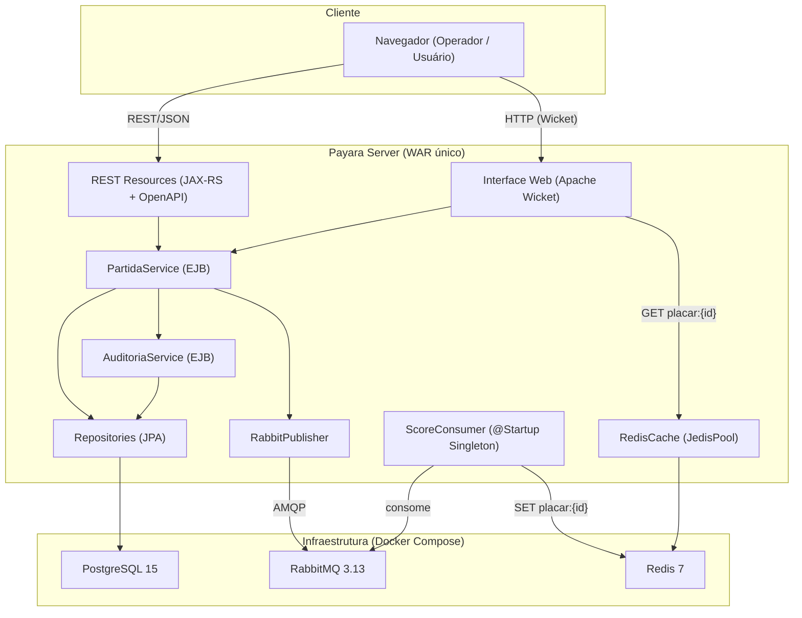
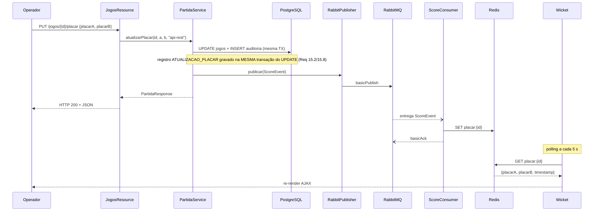
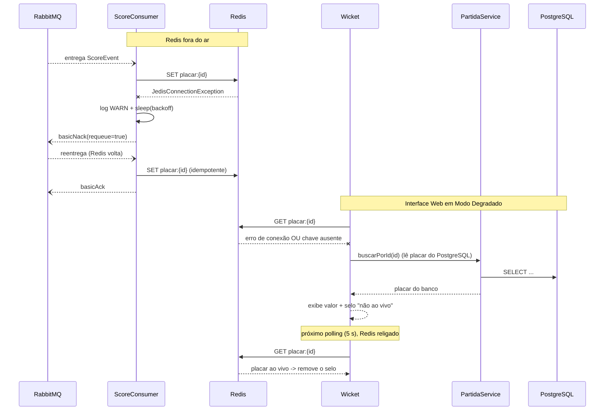
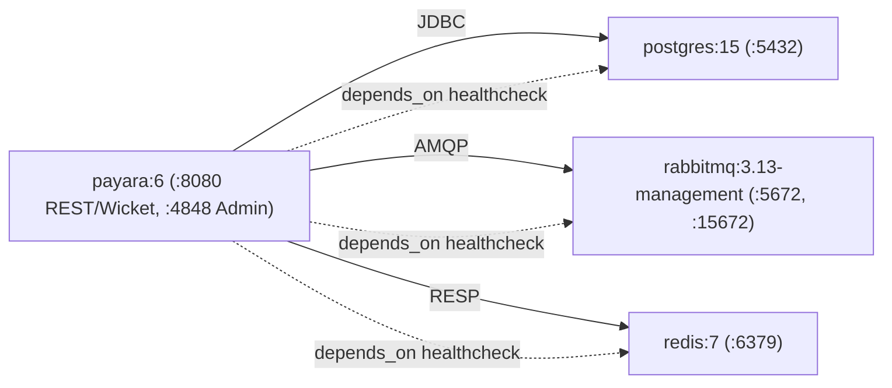

# Documento de Design — Placar em Tempo Real (Realtime Scoreboard)

## Overview

O **Placar em Tempo Real** é um sistema Jakarta EE que gerencia partidas de futebol, expõe uma API REST documentada, persiste dados em PostgreSQL via JPA, propaga atualizações de placar de forma assíncrona via RabbitMQ, armazena o estado atual no Redis e apresenta uma interface web reativa em Apache Wicket, executando sobre o Payara Server 6.

A API e a Interface Web são **abertas**: não há autenticação, autorização por papéis nem usuários. Qualquer cliente pode criar partidas, atualizar placares e alterar status sem login. O sistema **mantém** uma trilha de auditoria que registra a **origem** de cada operação de escrita (`"api-rest"` ou `"painel-web"`) — ela não identifica um usuário autenticado, apenas o canal de entrada da operação (Req 15).

O sistema é empacotado como um **único WAR** deployado no Payara. Publicador e consumidor de eventos vivem no mesmo processo JVM e conversam pelo RabbitMQ — o que dá desacoplamento lógico sem precisar de um serviço separado.

### Objetivos de Design

- **Simplicidade acima de tudo**: poucas classes, padrões idiomáticos de Jakarta EE, código que cabe na cabeça e é fácil de explicar.
- **Um único artefato**: um WAR no Payara; dependências externas sobem via Docker Compose.
- **Configuração em um só lugar**: toda configuração externa entra por **MicroProfile Config** (`@ConfigProperty`), injetada já com o tipo certo. Nenhuma classe chama `System.getenv` nem faz `parseInt` a cada requisição.
- **Baixa latência de leitura**: o Redis é o cache do placar; a Interface Web faz polling nesse cache a cada 5 s.
- **Consistência eventual**: **enquanto o Redis está disponível**, após um `PUT` de placar a cadeia PostgreSQL → RabbitMQ → Redis → Wicket converge em até 5 s (Req 3.2, 13.3). Quando o Redis está fora, esse prazo **não se aplica**: o evento fica represado na fila e a convergência acontece quando o Redis religa (Req 3.8 e Req 16), enquanto a tela mostra o placar do PostgreSQL.
- **Resiliência ao Redis**: o Redis é cache, não fonte da verdade. Se ele cai, nada se perde — o consumidor devolve o evento à fila (NACK com requeue) e tenta de novo com backoff; a Interface Web passa a ler o placar do PostgreSQL e mostra um selo de "não ao vivo", voltando sozinha ao normal quando o Redis religa (Req 16).

---

## Architecture

### Visão de alto nível



Todos os endpoints REST vivem sob o `@ApplicationPath("/api")` e são abertos — não há filtro de autenticação. A Swagger UI (`/openapi`, `/openapi-ui`) é servida pelo Payara **fora** do `@ApplicationPath("/api")`.

### Dois caminhos de entrada para a mesma regra de negócio

O sistema tem **dois canais de entrada** para a mesma regra de negócio, e isso é uma decisão consciente:

| Canal | Descrição |
|-------|-----------|
| **API REST** (`/api/...`) | Endpoints JAX-RS abertos, consumidos por integradores |
| **Interface Web** (Wicket, `/wicket/...`) | Páginas Wicket abertas, usadas via navegador |

O ponto importante: **a regra de negócio não é duplicada**. Os dois canais chamam o **mesmo `PartidaService`**, que é quem valida times iguais, status inválido, auto-transição e placar de partida encerrada.

### Fluxo de atualização de placar



### Fluxo de resiliência ao Redis (Req 16)



### Topologia Docker Compose



O serviço `payara` recebe, além das variáveis de conexão, `REDIS_RETRY_BACKOFF_INITIAL_MS` e `REDIS_RETRY_BACKOFF_MAX_MS` (backoff do consumidor) e `JOGOS_PAGE_SIZE_DEFAULT`/`JOGOS_PAGE_SIZE_MAX` (paginação). Todos os valores padrão de desenvolvimento ficam no `docker-compose.yml`.

---

## Components and Interfaces

### 1. Configuração externa (MicroProfile Config)

Toda configuração que vem de fora do artefato — hosts, portas, credenciais de infraestrutura, tamanhos de página, backoff — é injetada com **MicroProfile Config**, que já vem no Payara 6 (nenhuma dependência nova no `pom.xml`). O padrão é sempre o mesmo:

```java
@Inject @ConfigProperty(name = "JOGOS_PAGE_SIZE_DEFAULT", defaultValue = "20")
int pageSizeDefault;
```

O MicroProfile Config lê o valor das variáveis de ambiente (entre outras fontes), **converte para o tipo do campo** e injeta **uma vez**, na criação do bean.

> **Por que isso é melhor que `System.getenv`:** o valor chega **já tipado** (`int`, `long`), o `defaultValue` cobre a variável ausente sem `if` nem `NullPointerException`, e em teste basta setar o campo/usar um mock de configuração em vez de mexer no ambiente do processo. E a leitura acontece uma vez na injeção, não a cada requisição.

Convenção adotada neste projeto:

| Tipo de configuração | `defaultValue`? | Motivo |
|----------------------|-----------------|--------|
| Tamanhos, timeouts, backoff (`JOGOS_PAGE_SIZE_*`, `REDIS_RETRY_BACKOFF_*`) | **Sim** | Valor razoável de desenvolvimento; a ausência da variável não é um risco |
| Credenciais de infraestrutura (senhas de PostgreSQL/RabbitMQ) | **Não** | Sem `defaultValue`, o deploy **falha na subida** se a variável não foi informada — melhor do que rodar com uma senha fraca embutida (Req 11.1, 13.6) |
| Hosts, portas e nomes de recurso (`REDIS_HOST`, `RABBITMQ_*`) | Só host/porta de dev | Nenhum valor de conexão de produção fica no artefato (Req 11.1) |

Resumo do que cada componente injeta:

| Componente | Configuração injetada |
|------------|-----------------------|
| `PartidaService` | `JOGOS_PAGE_SIZE_DEFAULT` (padrão `20`), `JOGOS_PAGE_SIZE_MAX` (padrão `100`) |
| `RedisCache` | `REDIS_HOST` (padrão `localhost`), `REDIS_PORT` (padrão `6379`) |
| `RabbitConnection` | `RABBITMQ_HOST`, `RABBITMQ_PORT`, `RABBITMQ_USER`, `RABBITMQ_PASS` (sem padrão), `RABBITMQ_EXCHANGE`, `RABBITMQ_QUEUE`, `RABBITMQ_ROUTING_KEY` |
| `RabbitPublisher` | `RABBITMQ_EXCHANGE`, `RABBITMQ_ROUTING_KEY` |
| `ScoreConsumer` | `RABBITMQ_QUEUE`, `REDIS_RETRY_BACKOFF_INITIAL_MS` (padrão `500`), `REDIS_RETRY_BACKOFF_MAX_MS` (padrão `10000`) |

#### `JsonProducer` — o `ObjectMapper` como bean CDI (`config/`)

`RabbitPublisher`, `ScoreConsumer` e `RedisCache` recebem um `ObjectMapper` por injeção. **O `ObjectMapper` do Jackson não é um bean CDI**: é uma classe de biblioteca, sem anotação de escopo, e nenhum `@Produces` a expõe. Sem um producer, o CDI não encontra candidato para o ponto de injeção e o **deploy falha na subida** com *unsatisfied dependency*. O producer abaixo resolve isso em uma classe de cinco linhas:

```java
@ApplicationScoped
public class JsonProducer {

    // torna o ObjectMapper injetável em qualquer bean e garante UMA configuração para todo o sistema
    @Produces @ApplicationScoped
    public ObjectMapper objectMapper() {
        return new ObjectMapper()
            .registerModule(new JavaTimeModule())                 // LocalDateTime -> ISO-8601
            .disable(SerializationFeature.WRITE_DATES_AS_TIMESTAMPS);
    }
}
```

Duas decisões dentro dele:

- **`JavaTimeModule`**: sem ele o Jackson não sabe serializar `LocalDateTime` (usado no `ScoreEvent` e nos DTOs de partida) e lança erro em tempo de execução. Com o módulo registrado — e com `WRITE_DATES_AS_TIMESTAMPS` desligado — as datas saem e entram como texto **ISO-8601**, que é o formato que a API, o evento do RabbitMQ e o JSON do Redis documentam. Requer a dependência `com.fasterxml.jackson.datatype:jackson-datatype-jsr310` (mesma versão do `jackson-databind`).
- **Producer em vez de campo estático**: a alternativa mais simples seria um `private static final ObjectMapper MAPPER = ...` em cada classe que precisa dele. Funciona, mas repete a configuração (e o risco de esquecer o `JavaTimeModule`) em três lugares. Com o producer, a configuração existe **uma vez** e é reaproveitada por injeção — e em teste unitário basta passar um `new ObjectMapper()` no construtor ou no campo.

---

### 2. Estrutura do projeto (Maven — WAR único)

Organização por pacotes simples, uma classe por responsabilidade.

```
realtime-scoreboard/
├── pom.xml
└── src/
    ├── main/java/br/com/scoreboard/
    │   ├── config/          # Producers CDI
    │   │   └── JsonProducer.java          # @Produces ObjectMapper (JavaTimeModule, ISO-8601)
    │   ├── domain/          # Entidades JPA + enums
    │   │   ├── Partida.java
    │   │   ├── StatusPartida.java        # EM_ANDAMENTO, ENCERRADO
    │   │   ├── RegistroAuditoria.java    # @Entity @Table("auditoria")
    │   │   └── TipoAcao.java             # CRIACAO_PARTIDA, ATUALIZACAO_PLACAR, ALTERACAO_STATUS, EXCLUSAO_PARTIDA
    │   ├── dto/             # Requests/Responses e evento
    │   │   ├── CriarPartidaRequest.java
    │   │   ├── AtualizarPlacarRequest.java
    │   │   ├── AtualizarStatusRequest.java
    │   │   ├── PartidaResponse.java
    │   │   ├── AuditoriaResponse.java     # DTO da trilha de auditoria
    │   │   └── ScoreEvent.java
    │   ├── repository/      # JPA
    │   │   ├── PartidaRepository.java
    │   │   └── AuditoriaRepository.java   # salvar + consultar (filtros dinâmicos, ORDER BY timestamp DESC)
    │   ├── service/         # Regras de negócio (EJB)
    │   │   ├── PartidaService.java
    │   │   └── AuditoriaService.java      # @Stateless: registrar(...) e consultar(...)
    │   ├── messaging/       # RabbitMQ
    │   │   ├── RabbitConnection.java      # @Startup @Singleton (conexão)
    │   │   ├── RabbitPublisher.java
    │   │   └── ScoreConsumer.java         # @Startup @Singleton (consumo + backoff)
    │   ├── cache/           # Redis (Jedis)
    │   │   └── RedisCache.java            # cria e fecha o JedisPool
    │   ├── rest/            # JAX-RS
    │   │   ├── ScoreboardApplication.java
    │   │   ├── JogosResource.java
    │   │   ├── AuditoriaResource.java     # GET /auditoria (aberto)
    │   │   └── HealthResource.java
    │   ├── web/             # Apache Wicket
    │   │   ├── WicketApplication.java
    │   │   ├── HomePage.java
    │   │   ├── PartidaListPanel.java
    │   │   └── PartidaRowPanel.java
    │   └── exception/       # Exceções de domínio + mapper
    │       ├── PartidaNaoEncontradaException.java
    │       ├── RegraNegocioException.java  # carrega o status HTTP (400 ou 422)
    │       └── GlobalExceptionMapper.java
    ├── main/resources/
    │   ├── META-INF/persistence.xml
    │   └── db/migration/    # Flyway
    │       ├── V1__create_jogos.sql
    │       └── V3__create_auditoria.sql   # tabela auditoria + índices
    ├── main/webapp/         # web.xml, .html do Wicket, CSS estático
    └── test/java/br/com/scoreboard/
        ├── service/         # testes unitários (Mockito)
        ├── web/             # testes de UI (WicketTester)
        └── integration/     # testes de integração (Testcontainers + REST-assured)
```

> **Por que WAR único:** evita a complexidade de multi-módulos Maven para um escopo bem definido. Tudo no mesmo classloader simplifica CDI e transações JTA.

---

### 3. REST Resources (`rest/`)

#### `ScoreboardApplication` — ponto de entrada JAX-RS

```java
// tudo que é JAX-RS vive sob /api — então @Path("/jogos") = /api/jogos e @Path("/health") = /api/health
@ApplicationPath("/api")
public class ScoreboardApplication extends Application { }
```

#### `JogosResource` — endpoints principais

| Método | Path | Descrição |
|--------|------|-----------|
| `POST` | `/api/jogos` | Criar partida |
| `GET` | `/api/jogos` | Listar (filtros `status`, `time`; paginado) |
| `GET` | `/api/jogos/{id}` | Buscar por ID |
| `PUT` | `/api/jogos/{id}/placar` | Atualizar placar |
| `PUT` | `/api/jogos/{id}/status` | Alterar status (inclui reabertura) |

Todos os endpoints são abertos — não há anotação de papel nem filtro de autenticação.

```java
@Path("/jogos")
@Produces(MediaType.APPLICATION_JSON)
@Consumes(MediaType.APPLICATION_JSON)
public class JogosResource {

    @Inject PartidaService service;

    @POST
    @Operation(summary = "Criar partida")
    @APIResponse(responseCode = "201", description = "Partida criada")
    @APIResponse(responseCode = "400", description = "Dados inválidos")
    public Response criar(@Valid CriarPartidaRequest req) {
        PartidaResponse r = service.criar(req);
        return Response.status(201).entity(r).build();
    }

    // page/size chegam como texto de propósito: assim "page=abc" vira 400 e não o 404
    // que o JAX-RS devolveria se o parâmetro fosse declarado como int (Req 18.10/18.11)
    @GET
    @Operation(summary = "Listar partidas (paginado)")
    @APIResponse(responseCode = "200", description = "Página de partidas")
    @APIResponse(responseCode = "400", description = "status, page ou size inválido")
    public Response listar(@QueryParam("status") String status,
                           @QueryParam("time") String time,
                           @QueryParam("page") String page,
                           @QueryParam("size") String size) {
        return Response.ok(service.listar(status, time,
                inteiroNaoNegativo("page", page, 0),
                inteiroNaoNegativo("size", size, null))).build();
    }

    // converte o texto do parâmetro; ausente -> padrao; texto inválido ou negativo -> 400
    private Integer inteiroNaoNegativo(String nome, String valor, Integer padrao) {
        if (valor == null || valor.isBlank()) return padrao;
        try {
            int n = Integer.parseInt(valor.trim());
            if (n < 0) throw new NumberFormatException();
            return n;
        } catch (NumberFormatException e) {
            throw new RegraNegocioException(400,
                "Parâmetro '" + nome + "' inválido: informe um número inteiro maior ou igual a zero");
        }
    }

    @GET @Path("/{id}")
    @APIResponse(responseCode = "200", description = "Partida encontrada",
        content = @Content(schema = @Schema(implementation = PartidaResponse.class)))
    @APIResponse(responseCode = "404", description = "Não encontrada")
    public Response buscar(@PathParam("id") Long id) {
        return Response.ok(service.buscarPorId(id)).build();
    }

    @PUT @Path("/{id}/placar")
    public Response atualizarPlacar(@PathParam("id") Long id, @Valid AtualizarPlacarRequest req) {
        return Response.ok(service.atualizarPlacar(id, req.getPlacarA(), req.getPlacarB())).build();
    }

    @PUT @Path("/{id}/status")
    public Response atualizarStatus(@PathParam("id") Long id, @Valid AtualizarStatusRequest req) {
        return Response.ok(service.atualizarStatus(id, req.getStatus())).build();
    }
}
```

A validação de negócio (times iguais, status inválido, placar em partida encerrada) fica **no serviço**, o que mantém o resource fino e fácil de testar.

> **Por que `page`/`size` são `String` (Req 18.10/18.11):** se declarados como `int`, o JAX-RS não consegue converter `page=abc` e responde **404** — que não é o código esperado e confunde quem consome a API. Recebendo texto e convertendo no próprio recurso, a resposta é um **400** com mensagem clara, sem precisar de um `ExceptionMapper<ParamException>` adicional. Menos uma classe e um comportamento explícito, visível em três linhas de código.

O Payara expõe o documento OpenAPI em `/openapi` e a Swagger UI em `/openapi-ui` automaticamente (MicroProfile OpenAPI nativo no Payara 6), atendendo ao Req 9 sem gerar YAML/JSON manual.

**Cobertura da documentação (Req 9.3).** Além dos endpoints de `/jogos` (com os parâmetros `page` e `size`), o documento OpenAPI descreve também o endpoint aberto `GET /auditoria` e o health check `GET /api/health`. Todos os endpoints são abertos e acessíveis sem autenticação.

#### `AuditoriaResource` — trilha de auditoria — Req 15

Expõe a consulta da Trilha_de_Auditoria. É um endpoint **aberto** (sem autenticação, como o restante da API), com quatro filtros opcionais de query e resposta ordenada do mais recente para o mais antigo.

| Método | Path | Descrição |
|--------|------|-----------|
| `GET` | `/api/auditoria` | Consultar a trilha de auditoria (filtros `usuario`, `tipoAcao`, `dataInicio`, `dataFim`) |

```java
@Path("/auditoria")
@Produces(MediaType.APPLICATION_JSON)
public class AuditoriaResource {

    @Inject AuditoriaService auditoria;

    // endpoint aberto; todos os filtros são opcionais (Req 15.5, 15.6, 15.7)
    @GET
    @Operation(summary = "Consultar trilha de auditoria")
    @APIResponse(responseCode = "200", description = "Lista de registros, mais recente primeiro")
    public Response consultar(@QueryParam("usuario") String usuario,      // a Origem: "api-rest" ou "painel-web"
                              @QueryParam("tipoAcao") String tipoAcao,
                              @QueryParam("dataInicio") String dataInicio,
                              @QueryParam("dataFim") String dataFim) {
        List<AuditoriaResponse> registros = auditoria.consultar(usuario, tipoAcao, dataInicio, dataFim);
        return Response.ok(registros).build();
    }
}
```

O `usuario` filtra pela **Origem** da operação (não por um usuário logado — não existe login). A lista sempre chega ordenada por `timestamp` decrescente, porque o `AuditoriaRepository` aplica `ORDER BY timestamp DESC` na consulta.

#### `HealthResource` — health check — Req 13.9

O caminho **canônico** é `/api/health`: o recurso declara `@Path("/health")` e herda o prefixo `/api` do `@ApplicationPath`. É esse caminho que aparece na documentação OpenAPI, no `README.md` e no `docker-compose.yml`.

```java
@Path("/health")            // + @ApplicationPath("/api") = /api/health (Req 13.9)
@Produces(MediaType.APPLICATION_JSON)
public class HealthResource {

    @Inject PartidaRepository repo;
    @Inject RabbitConnection rabbit;
    @Inject RedisCache redis;

    @GET
    @Operation(summary = "Verificar saúde do sistema")
    @APIResponse(responseCode = "200", description = "PostgreSQL, RabbitMQ e Redis acessíveis")
    @APIResponse(responseCode = "503", description = "Algum serviço dependente indisponível")
    public Response health() {
        boolean ok = repo.pingOk() && rabbit.isOpen() && redis.pingOk();
        return Response.status(ok ? 200 : 503)
            .entity(Map.of("status", ok ? "UP" : "DOWN")).build();
    }
}
```

**Por que este endpoint nunca responde 500.** As três verificações — `PartidaRepository.pingOk()`, `RabbitConnection.isOpen()` e `RedisCache.pingOk()` — devolvem **booleano e nunca lançam**: cada uma captura internamente a falha da sua dependência e retorna `false`. Por isso a expressão `repo.pingOk() && rabbit.isOpen() && redis.pingOk()` sempre avalia, e a resposta é sempre **200** (tudo no ar) ou **503** (alguma dependência fora), exatamente como o Req 13.9 pede. Se qualquer uma delas propagasse exceção, o `GlobalExceptionMapper` transformaria o health check em 500 — que é justamente o código que o requisito não quer.

**Alias `/health` (opcional — Req 13.10).** Se for desejável responder também fora do prefixo `/api`, o alias é configurado no `web.xml` do Payara como um redirecionamento de `/health` para `/api/health`. É só conveniência: o caminho documentado e usado pelo healthcheck do Docker Compose continua sendo `/api/health`.

---

### 4. Service Layer (`service/`)

#### `PartidaService` — EJB Stateless

Toda a regra de negócio num único serviço.

```java
@Stateless
public class PartidaService {

    @Inject PartidaRepository repo;
    @Inject RabbitPublisher publisher;
    @Inject AuditoriaService auditoria;   // grava a trilha na MESMA transação (Req 15)
    @Inject ObjectMapper mapper;          // serializa o estado da partida criada para valorDepois

    // paginação: lida uma vez na injeção, já como int (Req 18.5)
    @Inject @ConfigProperty(name = "JOGOS_PAGE_SIZE_DEFAULT", defaultValue = "20")
    int pageSizeDefault;

    @Inject @ConfigProperty(name = "JOGOS_PAGE_SIZE_MAX", defaultValue = "100")
    int pageSizeMax;

    // a origem ("api-rest" / "painel-web") chega do canal de entrada; NÃO é um usuário logado (Req 15 nota)
    public PartidaResponse criar(CriarPartidaRequest req, String origem) {
        // comparação à prova de nulo: sem o teste de null, um timeA nulo daria NullPointerException (500)
        if (req.getTimeA() != null && req.getTimeA().equalsIgnoreCase(req.getTimeB()))
            throw new RegraNegocioException(400, "Os times da partida não podem ser iguais");
        Partida p = new Partida(req.getTimeA(), req.getTimeB(), req.getDataHoraPartida()); // placar 0, EM_ANDAMENTO
        repo.salvar(p);
        // auditoria na mesma transação: valorAntes=null, valorDepois=JSON da partida criada (Req 15.1)
        auditoria.registrar(TipoAcao.CRIACAO_PARTIDA, origem, p.getId(), null, toJson(p));
        return PartidaResponse.de(p);
    }

    public PartidaResponse atualizarPlacar(Long id, int placarA, int placarB, String origem) {
        Partida p = carregar(id);
        if (p.getStatus() == StatusPartida.ENCERRADO)
            throw new RegraNegocioException(422, "Não é permitido alterar o placar de uma partida encerrada");
        String antes = p.getPlacarA() + "x" + p.getPlacarB();   // placar anterior "AxB"
        // placar negativo já é barrado por @Min(0) no request (400)
        p.setPlacarA(placarA);
        p.setPlacarB(placarB);
        // auditoria ATUALIZACAO_PLACAR na mesma transação: valorAntes/valorDepois no formato "AxB" (Req 15.2)
        auditoria.registrar(TipoAcao.ATUALIZACAO_PLACAR, origem, id, antes, placarA + "x" + placarB);
        publisher.publicar(ScoreEvent.de(p)); // exceção de publicação é absorvida com log ERROR
        return PartidaResponse.de(p);
    }

    // Reabertura (Req 17) é apenas o caso ENCERRADO -> EM_ANDAMENTO deste mesmo método.
    public PartidaResponse atualizarStatus(Long id, StatusPartida novo, String origem) {
        Partida p = carregar(id);
        if (p.getStatus() == novo)
            throw new RegraNegocioException(422, "A partida já se encontra no status informado");
        String antes = p.getStatus().name();  // status anterior
        p.setStatus(novo);
        // auditoria ALTERACAO_STATUS na mesma transação: valorAntes=status anterior, valorDepois=novo (Req 15.3)
        auditoria.registrar(TipoAcao.ALTERACAO_STATUS, origem, id, antes, novo.name());
        return PartidaResponse.de(p);
    }

    public void excluir(Long id, String origem) {
        Partida p = carregar(id);
        String antes = p.getTimeA() + " " + p.getPlacarA() + "x" + p.getPlacarB()
                     + " " + p.getTimeB() + " (" + p.getStatus() + ")";  // descrição textual do estado anterior
        repo.excluir(p);
        // auditoria EXCLUSAO_PARTIDA na mesma transação: valorDepois="EXCLUIDO" (Req 15.4)
        auditoria.registrar(TipoAcao.EXCLUSAO_PARTIDA, origem, id, antes, "EXCLUIDO");
    }

    // serializa o estado da partida para o valorDepois de CRIACAO_PARTIDA; falha vira null (não derruba a escrita)
    private String toJson(Partida p) {
        try { return mapper.writeValueAsString(PartidaResponse.de(p)); }
        catch (Exception e) { return null; }
    }

    public PartidaResponse buscarPorId(Long id) {
        return PartidaResponse.de(carregar(id));
    }

    // page/size já chegam validados do recurso (não negativos); size nulo = usar o padrão
    public List<PartidaResponse> listar(String status, String time, int page, Integer size) {
        int tamanho = Math.min(size == null ? pageSizeDefault : size, pageSizeMax); // teto silencioso (Req 18.6)
        StatusPartida s = parseStatus(status); // 400 se inválido
        return repo.listar(s, time, page, tamanho).stream().map(PartidaResponse::de).toList();
    }

    private Partida carregar(Long id) {
        return repo.buscarPorId(id).orElseThrow(() ->
            new PartidaNaoEncontradaException("Partida " + id + " não encontrada"));
    }
}
```

**Campos nulos ou em branco não são responsabilidade do serviço (Req 1.2/1.3).** `timeA`, `timeB` e `dataHoraPartida` são barrados pelo **Bean Validation** no recurso: o `@Valid CriarPartidaRequest` aplica `@NotBlank`/`@NotNull` antes de o método do serviço ser chamado, e a violação vira **400** no `GlobalExceptionMapper`. O serviço, por isso, não repete essa checagem — ele só cuida da regra que o Bean Validation não expressa (times iguais), e faz isso de forma **segura contra nulo** para nunca virar `NullPointerException`/500 se algum chamador futuro passar um request não validado.

Consequência prática para a propriedade **R3**: o caminho verificado é o do Bean Validation, não uma checagem manual no serviço. O teste unitário de R3 valida as anotações do DTO com um `Validator` (`Validation.buildDefaultValidatorFactory().getValidator().validate(req)` e confere as violações), e o teste de integração confirma o **400** no endpoint. Nenhum teste espera que `service.criar(...)` rejeite nulo por conta própria.

**Reabertura (Req 17) — sem endpoint nem método novo.** É o caso particular `ENCERRADO → EM_ANDAMENTO` do `atualizarStatus`: reutiliza o `PUT /jogos/{id}/status` e a checagem de auto-transição. Depois da transição, o placar volta a ser editável naturalmente, porque `atualizarPlacar` só rejeita quando o status é `ENCERRADO` (Req 17.3).

#### `AuditoriaService` — EJB Stateless (trilha de auditoria, Req 15)

Serviço fino que grava e consulta a Trilha_de_Auditoria. Tem apenas dois métodos: `registrar(...)`, chamado pelo `PartidaService` em cada operação de escrita, e `consultar(...)`, usado pelo `AuditoriaResource`.

```java
@Stateless
public class AuditoriaService {

    @Inject AuditoriaRepository repo;

    // Chamado DENTRO da transação da operação de negócio (JTA REQUIRED herdada):
    // o INSERT da auditoria e a escrita da partida compartilham a mesma TX (Req 15.8).
    // 'origem' é a Origem ("api-rest"/"painel-web"), gravada na coluna 'usuario' — não é usuário logado.
    public void registrar(TipoAcao tipo, String origem, Long idEntidade, String antes, String depois) {
        RegistroAuditoria r = new RegistroAuditoria();
        r.setTipoAcao(tipo);
        r.setUsuario(origem);              // a coluna 'usuario' guarda a ORIGEM da operação
        r.setEntidadeAfetada("Partida");
        r.setIdEntidade(idEntidade);
        r.setValorAntes(antes);
        r.setValorDepois(depois);
        r.setTimestamp(LocalDateTime.now());
        repo.salvar(r);
    }

    // filtros todos opcionais; a lista já vem ordenada por timestamp DESC do repositório (Req 15.5/15.6)
    public List<AuditoriaResponse> consultar(String usuario, String tipoAcao, String dataInicio, String dataFim) {
        return repo.consultar(usuario, tipoAcao, dataInicio, dataFim).stream()
            .map(AuditoriaResponse::de).toList();
    }
}
```

**Atomicidade (Req 15.8).** `AuditoriaService` é `@Stateless` e `registrar(...)` roda na transação JTA `REQUIRED` **herdada** do método do `PartidaService` que o chamou — não abre transação nova. Assim, o `INSERT` na tabela `auditoria` e o `UPDATE`/`INSERT`/`DELETE` da partida entram e saem juntos: se qualquer um falhar, o rollback desfaz ambos, e nunca há partida alterada sem seu registro de auditoria (nem o contrário).

**Origem, não usuário (Req 15 nota).** O parâmetro `origem` que o `PartidaService` repassa é `"api-rest"` (quando a chamada veio do `JogosResource`) ou `"painel-web"` (quando veio da Interface Web Wicket). Ele é gravado na coluna `usuario` do registro apenas por compatibilidade de esquema — o sistema **não tem login**, então esse campo nunca identifica uma pessoa autenticada, só o canal de entrada.

---

### 5. Repository Layer (`repository/`)

#### `PartidaRepository` — JPA com uma única consulta de listagem

Em vez de vários métodos de listagem, uma única consulta monta o filtro dinâmico e aplica a paginação com `setFirstResult`/`setMaxResults` (Req 18).

```java
@ApplicationScoped
public class PartidaRepository {

    @PersistenceContext(unitName = "scoreboardPU")
    EntityManager em;

    public Partida salvar(Partida p) { return em.merge(p); }

    public Optional<Partida> buscarPorId(Long id) {
        return Optional.ofNullable(em.find(Partida.class, id));
    }

    // filtro opcional por status e por time (substring, case-insensitive) + paginação (Req 2, 18)
    public List<Partida> listar(StatusPartida status, String time, int page, int size) {
        StringBuilder jpql = new StringBuilder("SELECT p FROM Partida p WHERE 1=1");
        if (status != null) jpql.append(" AND p.status = :status");
        if (time != null && !time.isBlank())
            jpql.append(" AND (LOWER(p.timeA) LIKE :time OR LOWER(p.timeB) LIKE :time)");
        jpql.append(" ORDER BY p.id");

        TypedQuery<Partida> q = em.createQuery(jpql.toString(), Partida.class);
        if (status != null) q.setParameter("status", status);
        if (time != null && !time.isBlank()) q.setParameter("time", "%" + time.toLowerCase() + "%");
        q.setFirstResult(page * size);  // OFFSET
        q.setMaxResults(size);          // LIMIT -> nunca varre a tabela inteira (Req 18.1)
        return q.getResultList();
    }

    // usado no /api/health: responde "o banco está acessível?" como booleano, sem lançar
    public boolean pingOk() {
        try {
            em.createNativeQuery("SELECT 1").getSingleResult(); // nativa: JPQL não aceita "SELECT 1"
            return true;
        } catch (Exception e) {
            return false;   // banco fora -> health responde 503, não 500 (Req 13.9)
        }
    }
}
```

Dois detalhes do `pingOk()` que são fáceis de errar:

- **A query é nativa, não JPQL.** JPQL exige um `FROM` com entidade; `"SELECT 1"` passado para `createQuery` não compila como JPQL e lança `IllegalArgumentException`. `createNativeQuery` manda o `SELECT 1` direto para o PostgreSQL, que é exatamente o que um ping precisa.
- **A exceção é capturada e vira `false`.** Se ela subisse, o `HealthResource` cairia no `GlobalExceptionMapper` e responderia **500**, enquanto o Req 13.9 pede **503** para dependência indisponível. Como o método é uma *verificação*, ele devolve booleano — quem decide o código HTTP é o health check.

#### `AuditoriaRepository` — persistência e consulta da trilha (Req 15)

`@ApplicationScoped`, com dois métodos: `salvar(...)` (o `INSERT` que roda na transação da operação de negócio) e `consultar(...)`, que monta um filtro dinâmico com os quatro parâmetros opcionais e ordena por `timestamp DESC`.

```java
@ApplicationScoped
public class AuditoriaRepository {

    @PersistenceContext(unitName = "scoreboardPU")
    EntityManager em;

    public RegistroAuditoria salvar(RegistroAuditoria r) { return em.merge(r); }

    // filtro dinâmico: só entra na cláusula o parâmetro informado; sempre ORDER BY timestamp DESC (Req 15.5/15.6)
    public List<RegistroAuditoria> consultar(String usuario, String tipoAcao, String dataInicio, String dataFim) {
        StringBuilder jpql = new StringBuilder("SELECT r FROM RegistroAuditoria r WHERE 1=1");
        if (usuario  != null && !usuario.isBlank())  jpql.append(" AND r.usuario = :usuario");
        if (tipoAcao != null && !tipoAcao.isBlank())  jpql.append(" AND r.tipoAcao = :tipoAcao");
        if (dataInicio != null && !dataInicio.isBlank()) jpql.append(" AND r.timestamp >= :dataInicio");
        if (dataFim    != null && !dataFim.isBlank())    jpql.append(" AND r.timestamp <= :dataFim");
        jpql.append(" ORDER BY r.timestamp DESC");   // mais recente primeiro (Req 15.5)

        TypedQuery<RegistroAuditoria> q = em.createQuery(jpql.toString(), RegistroAuditoria.class);
        if (usuario  != null && !usuario.isBlank())  q.setParameter("usuario", usuario);
        if (tipoAcao != null && !tipoAcao.isBlank())  q.setParameter("tipoAcao", TipoAcao.valueOf(tipoAcao));
        if (dataInicio != null && !dataInicio.isBlank()) q.setParameter("dataInicio", LocalDateTime.parse(dataInicio));
        if (dataFim    != null && !dataFim.isBlank())    q.setParameter("dataFim", LocalDateTime.parse(dataFim));
        return q.getResultList();
    }
}
```

O filtro por `usuario` é, na prática, filtro por **Origem** (`"api-rest"`/`"painel-web"`). Os parâmetros usam binding nomeado (sem concatenação de valores), e a ordenação decrescente por `timestamp` é fixa na consulta — o `AuditoriaResource` não precisa reordenar nada.

---

### 6. Messaging Layer (`messaging/`)

#### `RabbitConnection` — conexão compartilhada (`@Startup @Singleton`)

```java
@Startup
@Singleton
public class RabbitConnection {

    @Inject @ConfigProperty(name = "RABBITMQ_HOST", defaultValue = "localhost") String host;
    @Inject @ConfigProperty(name = "RABBITMQ_PORT", defaultValue = "5672")      int porta;
    @Inject @ConfigProperty(name = "RABBITMQ_USER")  String usuario;   // credencial: sem padrão
    @Inject @ConfigProperty(name = "RABBITMQ_PASS")  String senha;     // credencial: sem padrão
    @Inject @ConfigProperty(name = "RABBITMQ_EXCHANGE")    String exchange;
    @Inject @ConfigProperty(name = "RABBITMQ_QUEUE")       String fila;
    @Inject @ConfigProperty(name = "RABBITMQ_ROUTING_KEY") String routingKey;

    private Connection connection;

    @PostConstruct
    void init() throws Exception {
        ConnectionFactory f = new ConnectionFactory();
        f.setHost(host);
        f.setPort(porta);                    // já é int: nenhum parseInt aqui
        f.setUsername(usuario);
        f.setPassword(senha);
        f.setAutomaticRecoveryEnabled(true); // reconecta ao RabbitMQ sozinho
        this.connection = f.newConnection();
        try (Channel ch = connection.createChannel()) {
            ch.exchangeDeclare(exchange, "direct", true);
            ch.queueDeclare(fila, true, false, false, null);
            ch.queueBind(fila, exchange, routingKey);
        }
    }

    public String getExchange()   { return exchange; }
    public String getRoutingKey() { return routingKey; }
    public String getFila()       { return fila; }

    public Connection get() { return connection; }
    public boolean isOpen() { return connection != null && connection.isOpen(); }

    @PreDestroy
    void fechar() throws Exception { if (connection != null) connection.close(); }
}
```

#### `RabbitPublisher` — publica o evento (Req 5)

```java
@ApplicationScoped
public class RabbitPublisher {

    private static final Logger log = Logger.getLogger(RabbitPublisher.class.getName());

    private RabbitConnection conn;
    private ObjectMapper mapper;

    // exigido pelo CDI: bean de escopo normal precisa de construtor sem argumentos para o proxy
    protected RabbitPublisher() { }

    // injeção por construtor: o CDI resolve as duas dependências e o teste unitário
    // simplesmente instancia a classe com um mock e um ObjectMapper de verdade
    @Inject
    public RabbitPublisher(RabbitConnection conn, ObjectMapper mapper) {
        this.conn = conn;
        this.mapper = mapper;
    }

    public void publicar(ScoreEvent evento) {
        try (Channel ch = conn.get().createChannel()) {
            byte[] json = mapper.writeValueAsBytes(evento);
            // exchange e routing key vêm da RabbitConnection, que já os recebeu da configuração
            ch.basicPublish(conn.getExchange(), conn.getRoutingKey(),
                            MessageProperties.PERSISTENT_TEXT_PLAIN, json);
        } catch (Exception e) {
            // falha na publicação não derruba a resposta HTTP (Req 5.5)
            log.log(Level.SEVERE, "Falha ao publicar evento da partida id=" + evento.getId(), e);
        }
    }
}
```

> **Por que injeção por construtor aqui:** é o estilo idiomático em CDI e deixa o teste trivial — `new RabbitPublisher(mock(RabbitConnection.class), new ObjectMapper())`, sem mexer em campos por reflexão. O construtor `protected` sem argumentos existe porque o CDI precisa dele para criar o proxy de um bean `@ApplicationScoped`; ele nunca é chamado pela aplicação. O `ObjectMapper` vem do `JsonProducer`.

#### `ScoreConsumer` — consome e atualiza o Redis, com resiliência (Req 6, 16)

O consumidor separa duas situações de falha, e é aqui que mora a resiliência ao Redis:

- **Redis fora do ar** (`JedisException`) — falha recuperável: NACK **com requeue**, dorme um backoff crescente (limitado pelo teto) e deixa o evento voltar à fila. Tenta indefinidamente até dar certo. Log `WARN`.
- **Payload inválido** (erro de desserialização) — falha irrecuperável: NACK **sem requeue** para não virar loop. Log `ERROR`.

```java
@Startup
@Singleton
public class ScoreConsumer {

    private static final Logger log = Logger.getLogger(ScoreConsumer.class.getName());

    // campos package-private de propósito: o teste unitário, no mesmo pacote, os preenche direto
    @Inject RabbitConnection conn;
    @Inject RedisCache redis;
    @Inject ObjectMapper mapper;   // vem do JsonProducer

    // backoff configurável, já em long (Req 6.7/16.2)
    @Inject @ConfigProperty(name = "REDIS_RETRY_BACKOFF_INITIAL_MS", defaultValue = "500")
    long backoffInicial;

    @Inject @ConfigProperty(name = "REDIS_RETRY_BACKOFF_MAX_MS", defaultValue = "10000")
    long backoffMax;

    private long backoffAtual;

    @PostConstruct
    void iniciar() throws Exception {
        backoffAtual = backoffInicial;

        Channel ch = conn.get().createChannel();
        ch.basicQos(1); // um evento por vez, preserva a ordem
        ch.basicConsume(conn.getFila(), false, new DefaultConsumer(ch) {
            @Override
            public void handleDelivery(String tag, Envelope env, AMQP.BasicProperties props, byte[] body)
                    throws IOException {
                // o consumidor do broker só delega: toda a lógica vive em processar()
                processar(ch, env.getDeliveryTag(), new String(body, StandardCharsets.UTF_8));
            }
        });
    }

    // package-private para teste: o teste unitário chama este método com um Channel mockado,
    // sem precisar de RabbitMQ no ar (é o que a tarefa 10.3 previa)
    void processar(Channel ch, long deliveryTag, String body) throws IOException {
        ScoreEvent evento;
        try {
            evento = mapper.readValue(body, ScoreEvent.class); // pode lançar (irrecuperável)
        } catch (Exception parse) {
            log.log(Level.SEVERE, "Payload inválido; descartando mensagem", parse);
            ch.basicNack(deliveryTag, false, false); // sem requeue (Req 6.3 / 16.5)
            return;
        }
        try {
            redis.atualizarPlacar(evento);           // idempotente (SET sobrescreve)
            backoffAtual = backoffInicial;           // sucesso: reseta o backoff
            ch.basicAck(deliveryTag, false);
        } catch (JedisException redisFora) {         // Redis indisponível (recuperável)
            log.log(Level.WARNING, "Redis indisponível (id=" + evento.getId()
                + "); backoff de " + backoffAtual + " ms antes de reprocessar", redisFora);
            dormir(backoffAtual);
            backoffAtual = Math.min(backoffAtual * 2, backoffMax); // cresce até o teto
            ch.basicNack(deliveryTag, false, true);  // requeue (Req 6.6 / 16.1)
        }
    }

    private void dormir(long ms) {
        try { Thread.sleep(ms); } catch (InterruptedException e) { Thread.currentThread().interrupt(); }
    }
}
```

- **`processar` extraído do `DefaultConsumer`:** o `handleDelivery` apenas converte o `byte[]` em `String` (UTF-8) e delega. Com a lógica num método próprio, o teste unitário exercita ACK, NACK com requeue e NACK sem requeue passando um `Channel` mockado e um `body` de texto — sem broker, sem Redis e sem container.
- **Idempotência (Req 6.4 / 16.4):** `atualizarPlacar` faz um `SET` que sobrescreve a chave inteira, então reprocessar o mesmo evento N vezes dá o mesmo resultado que processar uma vez.
- **Convergência (Req 16.3):** enquanto o Redis está fora, os eventos ficam represados na fila; ao religar, o consumidor processa em ordem e a chave `placar:{id}` converge para o evento mais recente.
- **Teto do backoff:** `REDIS_RETRY_BACKOFF_MAX_MS` deve ficar abaixo do `consumer_timeout` do RabbitMQ, para o sleep controlado não disparar cancelamento do consumidor. Um único campo `backoffAtual` (com `basicQos(1)`, um evento por vez) é suficiente e mantém o código direto.
- **Tradeoff assumido — `Thread.sleep` e `basicQos(1)`:** dormir no thread do consumidor segura a fila inteira enquanto o Redis não volta (*head-of-line blocking*): com um evento por vez, o evento da frente atrasa os de trás. Aceitamos isso de propósito, porque aqui a consequência é apenas o cache demorar mais para atualizar — o PostgreSQL já tem o dado e a tela cai no Fallback_de_Leitura. Em produção, com volume maior, a escolha natural seria trocar o sleep por **fila de retry com TTL + dead-letter exchange** (o RabbitMQ atrasa a reentrega sem bloquear nenhum thread) e subir o `basicQos`; é mais robusto, mas exige declarar mais recursos no broker do que este escopo justifica.

> **Nota:** usar o `rabbitmq-client` diretamente (sem MDB/JMS) é a abordagem prática para RabbitMQ em Jakarta EE, já que não há resource adapter AMQP maduro para o Payara 6. A reconexão ao RabbitMQ é automática; a resiliência ao **Redis** é a estratégia de requeue + backoff acima.

---

### 7. Cache Layer (`cache/`)

Uma única classe cuida do pool Jedis e das operações. Sem producer separado — o `JedisPool` é criado e fechado na própria classe.

```java
@ApplicationScoped
public class RedisCache {

    private static final String PREFIXO = "placar:";
    private static final int TTL = 86400; // 24 h

    @Inject @ConfigProperty(name = "REDIS_HOST", defaultValue = "localhost") String host;
    @Inject @ConfigProperty(name = "REDIS_PORT", defaultValue = "6379")      int porta;

    @Inject ObjectMapper mapper;

    private JedisPool pool;

    @PostConstruct
    void init() {
        // host e porta já tipados pela configuração; nada de parseInt por requisição
        this.pool = new JedisPool(new JedisPoolConfig(), host, porta);
    }

    // idempotente: sobrescreve a chave inteira (Req 6.1/6.4)
    public void atualizarPlacar(ScoreEvent e) {
        String valor = toJson(Map.of("placarA", e.getPlacarA(),
                                     "placarB", e.getPlacarB(),
                                     "timestamp", e.getTimestamp()));
        try (Jedis jedis = pool.getResource()) {
            jedis.setex(PREFIXO + e.getId(), TTL, valor);
        }
    }

    // Optional.empty() = chave ausente (Redis vivo); exceção = Redis fora do ar
    public Optional<String> buscarPlacar(Long id) {
        try (Jedis jedis = pool.getResource()) {
            return Optional.ofNullable(jedis.get(PREFIXO + id));
        }
    }

    // único método que NÃO propaga: é uma verificação, então devolve booleano (usado no /api/health)
    public boolean pingOk() {
        try (Jedis jedis = pool.getResource()) {
            return "PONG".equals(jedis.ping());
        } catch (JedisException e) {
            return false;   // Redis fora -> health responde 503, não 500 (Req 13.9)
        }
    }

    @PreDestroy
    void fechar() { if (pool != null) pool.close(); }
}
```

**Comportamento sob falha do Redis (Req 16):** as operações de **dados** — `atualizarPlacar` e `buscarPlacar` — **propagam** a `JedisException` (não engolem), para cada chamador decidir sua estratégia:

- **Consumidor:** trata como falha recuperável (requeue + backoff).
- **Interface Web:** trata a exceção do polling — ou o `Optional.empty()` (chave ausente) — como Modo Degradado e cai no placar do PostgreSQL.

> **Por que o `pingOk()` é a exceção da regra (distinção sutil, mas proposital):** *ping é uma verificação, então retorna booleano; as operações de dados propagam para o chamador decidir.* O `pingOk()` já tem uma resposta para "o Redis está fora": `false`. Se ele propagasse a `JedisException`, o `/api/health` responderia **500** em vez do **503** exigido pelo Req 13.9. Já em `atualizarPlacar`/`buscarPlacar` a exceção é a informação que o consumidor usa para fazer requeue e que a UI usa para entrar em Modo Degradado — engoli-la ali quebraria os Req 16.1 e 16.6.

> **Por que Jedis e não Lettuce:** o padrão de acesso aqui é síncrono e simples; o Jedis com pool resolve com menos conceitos (sem Reactor/RxJava), o que é mais fácil de explicar.

---

### 8. Interface Web (`web/`)

#### `WicketApplication` — bootstrap

```java
public class WicketApplication extends WebApplication {
    @Override public Class<HomePage> getHomePage() { return HomePage.class; }
    @Override protected void init() {
        super.init();
        getMarkupSettings().setDefaultMarkupEncoding("UTF-8");
    }
}
```

Registrado no `web.xml` como `WicketFilter` no path `/wicket/*` — o mesmo path já criado no `web.xml` do projeto. As páginas da interface ficam então sob `/wicket/...`, separadas do prefixo `/api` do JAX-RS. As páginas são abertas: não há login nem sessão autenticada.

#### `PartidaListPanel` — listagem com polling de 5 s

```java
public class PartidaListPanel extends Panel {

    @Inject PartidaService service;
    @Inject RedisCache redis;

    // mesmo padrão do resto do sistema: configuração injetada e tipada (Req 7.4, 18.3)
    @Inject @ConfigProperty(name = "JOGOS_PAGE_SIZE_DEFAULT", defaultValue = "20")
    int tamanhoPagina;

    private int pagina = 0;            // índice da página exibida (base 0)
    private String filtroStatus;       // null = todos os status (Req 7.5)
    private int itensNaPagina;         // quantos vieram na última carga (guia os botões)

    public PartidaListPanel(String id) {
        super(id);
        setOutputMarkupId(true);

        ListView<PartidaViewModel> lista = new ListView<>("partidas", this::carregar) {
            @Override protected void populateItem(ListItem<PartidaViewModel> item) {
                item.add(new PartidaRowPanel("row", item.getModelObject()));
            }
        };
        add(lista);

        // Req 7.15 — navegação entre páginas por AJAX, preservando o filtro por status
        add(new AjaxLink<Void>("anterior") {
            @Override public void onClick(AjaxRequestTarget t) { irPara(pagina - 1, t); }
            @Override public boolean isEnabled() { return pagina > 0; }
        });
        add(new AjaxLink<Void>("proxima") {
            @Override public void onClick(AjaxRequestTarget t) { irPara(pagina + 1, t); }
            // página cheia sugere que há mais registros adiante
            @Override public boolean isEnabled() { return itensNaPagina == tamanhoPagina; }
        });
        add(new Label("indicadorPagina", () -> "Página " + (pagina + 1)));

        // Req 8.1 — polling a cada 5 s; re-renderiza o painel (mantém a página atual)
        add(new AjaxSelfUpdatingTimerBehavior(Duration.ofSeconds(5)));
    }

    private void irPara(int novaPagina, AjaxRequestTarget target) {
        this.pagina = Math.max(0, novaPagina);
        target.add(this);   // re-renderiza só o painel, sem recarregar a página (Req 7.15)
    }

    // Para cada partida: tenta o Redis; se falhar ou a chave não existir, usa o placar do banco (Req 16.6)
    // o PartidaService ainda limita o tamanho ao teto JOGOS_PAGE_SIZE_MAX (Req 18.6)
    private List<PartidaViewModel> carregar() {
        List<PartidaViewModel> itens = service.listar(filtroStatus, null, pagina, tamanhoPagina)
            .stream().map(this::montar).toList();
        this.itensNaPagina = itens.size();
        return itens;
    }

    PartidaViewModel montar(PartidaResponse p) {
        try {
            Optional<String> cache = redis.buscarPlacar(p.getId());
            if (cache.isPresent()) return PartidaViewModel.aoVivo(p, cache.get()); // Redis ao vivo
            return PartidaViewModel.doBanco(p);                                    // chave ausente -> banco
        } catch (JedisException redisFora) {
            return PartidaViewModel.doBanco(p);                                    // Redis fora -> banco
        }
    }
}
```

O `PartidaViewModel` é reconstruído a cada ciclo, então a flag `aoVivo` sempre reflete o último polling. Quando o Redis volta, o próximo ciclo já vira `aoVivo == true` e o selo some — sem reload e sem ação do usuário (Req 16.9).

O filtro por status (Req 7.5) é um `DropDownChoice` sobre o campo `filtroStatus`; ao mudar, ele volta para a página 0 e chama `target.add(this)`. Como `carregar()` sempre usa `filtroStatus` e `pagina`, o filtro é naturalmente preservado ao navegar entre páginas (Req 7.15) — não há estado duplicado a sincronizar.

#### `PartidaRowPanel` — linha com controles por status

Cada linha mostra times, placar, badge de status e — conforme o status — os controles de escrita. A visibilidade depende apenas do `status` da partida.

| Status | Controles exibidos |
|--------|--------------------|
| `EM_ANDAMENTO` | times, placar e status; edição de `placarA`/`placarB`; botão "Encerrar" |
| `ENCERRADO` | times, placar e status; botão "Reabrir" |

**Regra de visibilidade:** os controles de escrita são criados condicionados apenas ao `status` da partida — edição de placar e botão "Encerrar" para `EM_ANDAMENTO`, botão "Reabrir" para `ENCERRADO` (Req 7.6, 7.7, 7.11). O formulário de criação de partida (no `HomePage`) fica sempre visível. Não há controle por papel: os controles de escrita são exibidos incondicionalmente na partida do status apropriado.

Pontos cobertos:

- **Selo "não ao vivo" (Req 16.7):** um `Label` com `setVisible(!vm.isAoVivo())` e a classe CSS `.nao-ao-vivo`. Aparece se, e somente se, o último polling falhou ou a chave não existe.
- **Campo de placar validado (Req 7.13):** um `NumberTextField<Integer>` com `RangeValidator.minimum(0)`. Valor não numérico falha na conversão do Wicket e **bloqueia a submissão** — nenhuma chamada REST é feita; a mensagem ("Informe um número inteiro maior ou igual a zero") aparece num `FeedbackPanel` ao lado do campo, sem recarregar a página. Isso complementa o 400 da API (Req 3.6).
- **Reabertura (Req 7.11–7.12, 17):** botão "Reabrir" visível para partidas `ENCERRADO`; ao clicar, abre confirmação e chama `service.atualizarStatus(id, EM_ANDAMENTO)` — o mesmo caminho das outras transições. Depois da reabertura, o polling reconstrói a linha e os controles de edição de placar voltam a aparecer (Req 8.7).
- **Destaque de placar alterado (Req 8.2):** ao detectar mudança de `placarA`/`placarB` no ciclo, a label recebe a classe CSS `.score-updated` por alguns segundos.

CSS estático (`src/main/webapp/static/scoreboard.css`):

```css
.nao-ao-vivo { display:inline-block; font-size:.75rem; padding:.1rem .4rem;
               border-radius:.25rem; background:#b45309; color:#fff; }
.score-updated { background:#fef08a; transition: background 2s ease-out; }
```

---

## Data Models

### Entidade `Partida`

```java
@Entity
@Table(name = "jogos", indexes = {
    @Index(name = "idx_jogos_status", columnList = "status"),
    @Index(name = "idx_jogos_time_a", columnList = "time_a"),
    @Index(name = "idx_jogos_time_b", columnList = "time_b")
})
public class Partida {

    @Id @GeneratedValue(strategy = GenerationType.IDENTITY)
    private Long id;

    @Column(name = "time_a", nullable = false, length = 100)
    private String timeA;

    @Column(name = "time_b", nullable = false, length = 100)
    private String timeB;

    @Column(name = "placar_a", nullable = false)
    private int placarA = 0;

    @Column(name = "placar_b", nullable = false)
    private int placarB = 0;

    @Enumerated(EnumType.STRING)
    @Column(nullable = false, length = 20)
    private StatusPartida status = StatusPartida.EM_ANDAMENTO;

    @Column(name = "data_hora_partida", nullable = false)
    private LocalDateTime dataHoraPartida;

    // construtores, getters, setters, equals/hashCode por id
}
```

### Enum `StatusPartida`

```java
public enum StatusPartida { EM_ANDAMENTO, ENCERRADO }
```

### Entidade `RegistroAuditoria` — Req 15

Mapeada na tabela `auditoria`. A coluna `usuario` guarda a **Origem** da operação (`"api-rest"`/`"painel-web"`), não um usuário logado.

```java
@Entity
@Table(name = "auditoria", indexes = {
    @Index(name = "idx_auditoria_usuario",   columnList = "usuario"),
    @Index(name = "idx_auditoria_tipo_acao", columnList = "tipo_acao"),
    @Index(name = "idx_auditoria_timestamp", columnList = "timestamp")
})
public class RegistroAuditoria {

    @Id @GeneratedValue(strategy = GenerationType.IDENTITY)
    private Long id;

    @Column(name = "usuario", nullable = false, length = 100)
    private String usuario;               // a ORIGEM: "api-rest" ou "painel-web"

    @Enumerated(EnumType.STRING)
    @Column(name = "tipo_acao", nullable = false, length = 30)
    private TipoAcao tipoAcao;

    @Column(name = "entidade_afetada", length = 50)
    private String entidadeAfetada;

    @Column(name = "id_entidade")
    private Long idEntidade;

    @Column(name = "valor_antes", columnDefinition = "TEXT")
    private String valorAntes;

    @Column(name = "valor_depois", columnDefinition = "TEXT")
    private String valorDepois;

    @Column(name = "timestamp", nullable = false)
    private LocalDateTime timestamp;

    // getters e setters
}
```

### Enum `TipoAcao`

```java
public enum TipoAcao { CRIACAO_PARTIDA, ATUALIZACAO_PLACAR, ALTERACAO_STATUS, EXCLUSAO_PARTIDA }
```

### DTOs

```java
public class CriarPartidaRequest {
    @NotBlank @Size(max = 100) private String timeA;   // > 100 chars -> 400 (Req 13.4)
    @NotBlank @Size(max = 100) private String timeB;
    @NotNull private LocalDateTime dataHoraPartida;
}

public class AtualizarPlacarRequest {
    @Min(0) private int placarA;   // negativo -> 400; não numérico -> 400 na desserialização (Req 3.5/3.7)
    @Min(0) private int placarB;
}

public class AtualizarStatusRequest {
    @NotNull private StatusPartida status;  // valor fora do enum -> 400
}

public class PartidaResponse {
    private Long id;
    private String timeA, timeB;
    private int placarA, placarB;
    private String status;
    private String dataHoraPartida; // ISO-8601
    public static PartidaResponse de(Partida p) { /* copia campos */ }
}

public class AuditoriaResponse {    // DTO da trilha de auditoria (Req 15.5)
    private Long id;
    private String usuario;         // a Origem: "api-rest" / "painel-web"
    private String tipoAcao;
    private String entidadeAfetada;
    private Long idEntidade;
    private String valorAntes;
    private String valorDepois;
    private String timestamp;       // ISO-8601
    public static AuditoriaResponse de(RegistroAuditoria r) { /* copia campos */ }
}

public class ScoreEvent {           // evento publicado no RabbitMQ (Req 5.2)
    private Long id;
    private String timeA, timeB;
    private int placarA, placarB;
    private String status;
    private String timestamp;       // ISO-8601
    public static ScoreEvent de(Partida p) { /* inclui timestamp = agora ISO-8601 */ }
}
```

### ViewModel da Interface Web: `PartidaViewModel` — Req 16

Modelo de apresentação da `PartidaListPanel`/`PartidaRowPanel`. Carrega o placar e a flag `aoVivo` que dirige o selo "não ao vivo".

```java
public class PartidaViewModel {
    private Long id;
    private String timeA, timeB, status;
    private int placarA, placarB;
    private boolean aoVivo;   // true = placar veio do Redis; false = veio do PostgreSQL (Modo Degradado)

    public static PartidaViewModel aoVivo(PartidaResponse p, String jsonCache) {
        // lê placarA/placarB do JSON do Redis; aoVivo = true
    }
    public static PartidaViewModel doBanco(PartidaResponse p) {
        // usa placarA/placarB da PartidaResponse (PostgreSQL); aoVivo = false
    }
    public boolean isAoVivo() { return aoVivo; }
    // getters
}
```

### Schema Redis

| Chave | Tipo | Valor | TTL |
|-------|------|-------|-----|
| `placar:{id}` | String (JSON) | `{"placarA":2,"placarB":1,"timestamp":"2024-06-15T20:35:00Z"}` | 86400 s |

### Migrações Flyway

`V1__create_jogos.sql`:

```sql
CREATE TABLE jogos (
    id                BIGSERIAL    PRIMARY KEY,
    time_a            VARCHAR(100) NOT NULL,
    time_b            VARCHAR(100) NOT NULL,
    placar_a          INT          NOT NULL DEFAULT 0 CHECK (placar_a >= 0),
    placar_b          INT          NOT NULL DEFAULT 0 CHECK (placar_b >= 0),
    status            VARCHAR(20)  NOT NULL DEFAULT 'EM_ANDAMENTO',
    data_hora_partida TIMESTAMP    NOT NULL
);
CREATE INDEX idx_jogos_status ON jogos (status);
CREATE INDEX idx_jogos_time_a ON jogos (time_a);
CREATE INDEX idx_jogos_time_b ON jogos (time_b);
```

`V3__create_auditoria.sql` (Req 15) — cria a tabela `auditoria` e seus índices; não há migração que a remova, a trilha permanece:

```sql
CREATE TABLE auditoria (
    id                BIGSERIAL    PRIMARY KEY,
    usuario           VARCHAR(100) NOT NULL,   -- a ORIGEM: "api-rest" / "painel-web" (não é usuário logado)
    tipo_acao         VARCHAR(30)  NOT NULL,   -- CRIACAO_PARTIDA, ATUALIZACAO_PLACAR, ALTERACAO_STATUS, EXCLUSAO_PARTIDA
    entidade_afetada  VARCHAR(50),
    id_entidade       BIGINT,
    valor_antes       TEXT,
    valor_depois      TEXT,
    timestamp         TIMESTAMP    NOT NULL
);
CREATE INDEX idx_auditoria_usuario   ON auditoria (usuario);
CREATE INDEX idx_auditoria_tipo_acao ON auditoria (tipo_acao);
CREATE INDEX idx_auditoria_timestamp ON auditoria (timestamp);
```

### `persistence.xml`

```xml
<persistence-unit name="scoreboardPU" transaction-type="JTA">
    <jta-data-source>java:app/jdbc/ScoreboardDS</jta-data-source>
    <class>br.com.scoreboard.domain.Partida</class>
    <class>br.com.scoreboard.domain.RegistroAuditoria</class>
    <properties>
        <!-- Flyway gerencia o schema; JPA não gera DDL -->
        <property name="jakarta.persistence.schema-generation.database.action" value="none"/>
        <property name="hibernate.dialect" value="org.hibernate.dialect.PostgreSQLDialect"/>
    </properties>
</persistence-unit>
```

O DataSource `java:app/jdbc/ScoreboardDS` é configurado no deploy do Payara a partir de variáveis de ambiente — URL, usuário e senha do PostgreSQL não aparecem no WAR (Req 11.1).

**Integridade e durabilidade (Req 10).** O PostgreSQL é a fonte da verdade: o mapeamento é JPA puro (Req 10.1), os `CHECK (placar >= 0)` das migrações garantem o placar não negativo no próprio banco (Req 10.2), o schema vive em migrações versionadas — então reiniciar o Payara não perde nem recria nada (Req 10.3) — e toda escrita roda em transação JTA `REQUIRED`, sem estado parcial (Req 10.4).

---

## Correctness Properties

Esta seção lista as **propriedades de corretude** do sistema: as regras de negócio e invariantes que devem valer sempre que o sistema executa. Cada linha da tabela é uma afirmação verificável sobre o comportamento esperado, ligada ao requisito que a origina.

A forma de verificação é **teste JUnit 5 por exemplo**: para cada propriedade escrevemos casos concretos de sucesso e de erro, incluindo os limites conhecidos (placar 0, placar negativo, string vazia, string com 101 caracteres, `page=abc`, JSON malformado). **Não há geração aleatória de entradas** — cada asserção é escrita à mão, legível e defensável linha a linha.

As propriedades centrais do sistema estão agrupadas abaixo. Cada uma reúne um conjunto de regras relacionadas e é verificada por **casos JUnit concretos**, listados no checklist detalhado ao final da seção.

### Property 1: Invariante de criação de partida

Toda partida criada com dados válidos nasce com `placarA=0`, `placarB=0`, `status=EM_ANDAMENTO` e `id` gerado. Times iguais, times em branco/ausentes ou `dataHoraPartida` inválida são rejeitados com 400 e nada é persistido.

**Validates: Requirements 1.1, 1.2, 1.3, 1.4**

### Property 2: Integridade dos filtros e da consulta

Toda listagem filtrada devolve apenas partidas que satisfazem o predicado do filtro — o `status` informado, ou o termo de busca contido em `timeA`/`timeB` (case-insensitive). A consulta por `id` devolve exatamente os dados persistidos, e `id` inexistente resulta em 404.

**Validates: Requirements 2.2, 2.3, 2.5, 2.6, 2.7**

### Property 3: Imutabilidade do placar em partida ENCERRADO

Para qualquer partida cujo status seja `ENCERRADO`, a tentativa de atualizar o placar retorna 422 e os dados permanecem intactos. A regra continua valendo enquanto a partida estiver encerrada, inclusive depois de uma tentativa recusada.

**Validates: Requirements 3.3, 17.4**

### Property 4: Placar sempre não negativo e numérico

Para qualquer entrada de placar negativa ou não numérica, a requisição é rejeitada com 400 antes de qualquer persistência — nenhum valor inválido chega ao PostgreSQL, que também impõe a restrição no próprio schema.

**Validates: Requirements 3.4, 3.6, 10.2**

### Property 5: Transições de status válidas e rejeição de auto-transição

Para qualquer partida, a transição para um status diferente do atual é aceita e persistida; a transição para o mesmo status é rejeitada com 422 e um status fora do enum com 400. Em ambos os casos de erro o status persistido não muda.

**Validates: Requirements 4.1, 4.2, 4.3, 4.4**

### Property 6: Completude e round-trip do evento de placar

Para toda atualização de placar bem-sucedida, um `ScoreEvent` é publicado com os 7 campos preenchidos. Serializar e desserializar esse evento com o `ObjectMapper` da aplicação preserva todos os campos, com datas em ISO-8601.

**Validates: Requirements 5.1, 5.2**

### Property 7: Degradação graciosa da publicação

Para qualquer falha na publicação no RabbitMQ, o erro é logado em ERROR e a resposta HTTP da atualização de placar continua sendo 200 — a indisponibilidade da mensageria nunca derruba a operação de escrita já persistida.

**Validates: Requirements 5.5**

### Property 8: Idempotência e convergência do cache

Para qualquer evento de placar, processá-lo uma ou N vezes deixa a chave `placar:{id}` no Redis no mesmo estado. Depois de uma indisponibilidade do Redis, a chave converge para os valores do evento mais recente.

**Validates: Requirements 6.1, 6.2, 6.4, 16.3, 16.4**

### Property 9: Não-descarte por falha recuperável, descarte de payload irrecuperável

Para qualquer falha recuperável (Redis fora do ar), o evento recebe NACK **com requeue** e backoff, e nunca é descartado. Para qualquer payload irrecuperável (malformado), o evento recebe NACK **sem requeue**, sem entrar em loop de reprocessamento.

**Validates: Requirements 6.3, 6.6, 6.7, 6.8, 16.1, 16.5**

### Property 10: Teto de paginação

Para qualquer combinação de `page`/`size`, a listagem devolve no máximo `min(size, JOGOS_PAGE_SIZE_MAX)` registros e nunca varre a tabela inteira. Parâmetros ausentes usam os valores padrão; parâmetros negativos ou não numéricos resultam em 400.

**Validates: Requirements 18.1, 18.4, 18.6, 18.7, 18.9, 18.10**

### Property 11: Opacidade de erros

Para qualquer erro retornado pela API, a resposta não contém stack trace nem nome de classe de exceção. Corpo JSON malformado, campo de tipo incompatível e parâmetros de paginação inválidos resultam em 400 descritivo, nunca em 5xx.

**Validates: Requirements 3.9, 13.5, 18.11**

### Property 12: Modo degradado observável na UI

Sempre que o cache em tempo real não estiver disponível, a interface web exibe o placar vindo do PostgreSQL e o selo "não ao vivo". O selo aparece se e somente se o polling falhou ou a chave não existe, e desaparece quando o cache volta.

**Validates: Requirements 8.6, 8.7, 8.8, 16.6, 16.7, 16.9**

### Property 13: Trilha de auditoria por operação de escrita

Toda operação de escrita bem-sucedida (criar, atualizar placar, alterar status, excluir) gera **exatamente um** Registro_de_Auditoria com o `TipoAcao` correto e a Origem informada, gravado na **mesma transação** da operação de negócio. A consulta `GET /auditoria` devolve os registros em ordem decrescente de `timestamp`, aplicando apenas os filtros informados.

**Validates: Requirements 15.1, 15.2, 15.3, 15.4, 15.5, 15.6, 15.8**

### Checklist detalhado de casos de teste

A tabela abaixo detalha, regra por regra, os casos de teste que verificam as propriedades acima. Cada regra vira um ou mais métodos `@Test`, e a coluna "Camada de teste" indica onde ela é verificada (unitário, integração, UI ou smoke).

| # | Propriedade de corretude (regra de negócio / invariante) | Requisitos | Camada de teste |
|---|-------------------------------|-----------|-----------------|
| R1 | Partida criada nasce com `placarA=0`, `placarB=0`, `status=EM_ANDAMENTO` e `id` gerado | 1.1 | Unitário (serviço) + Integração |
| R2 | `timeA == timeB` é rejeitado com 400 e mensagem específica | 1.4 | Unitário + Integração |
| R3 | `timeA`/`timeB` em branco/ausente → 400; `dataHoraPartida` inválida → 400 (caminho do Bean Validation no recurso, não do serviço) | 1.2, 1.3 | Unitário (`Validator` sobre o DTO) + Integração |
| R4 | Listagem filtrada por `status` retorna só partidas daquele status | 2.2, 2.3 | Unitário + Integração |
| R5 | `status` inválido na listagem → 400 | 2.4 | Integração |
| R6 | Busca por `time` retorna só partidas cujo `timeA`/`timeB` contém o termo (case-insensitive) | 2.5 | Unitário + Integração |
| R7 | `GET /jogos/{id}` devolve exatamente os dados persistidos; id inexistente → 404 | 2.6, 2.7 | Integração |
| R8 | Atualização de placar em partida `EM_ANDAMENTO` persiste os valores e retorna 200 | 3.1 | Unitário + Integração |
| R9 | Atualizar placar de partida `ENCERRADO` → 422, sem alterar dados | 3.3 | Unitário + Integração |
| R11 | Placar negativo → 400 antes de qualquer persistência | 3.4 | Unitário + Integração |
| R12 | Placar não numérico (ex.: `"abc"`) → 400, sem persistir, sem stack trace/exceção interna | 3.6, 13.5 | Integração |
| R13 | Atualizar placar de id inexistente → 404 | 3.5 | Integração |
| R14 | Transição de status entre valores distintos é aceita e persiste o novo status | 4.1, 4.2 | Unitário + Integração |
| R15 | Auto-transição (mesmo status) → 422 | 4.3 | Unitário + Integração |
| R16 | Status fora do enum → 400; id inexistente → 404 | 4.4, 4.5 | Integração |
| R17 | Após placar salvo, um `ScoreEvent` é publicado com os 7 campos preenchidos | 5.1, 5.2 | Unitário (Mockito no publisher) + Integração |
| R18 | Round-trip do `ScoreEvent` com o `ObjectMapper` do `JsonProducer`: serializar → desserializar preserva todos os campos, com datas em ISO-8601 | 5.2 | Unitário |
| R19 | Falha ao publicar no RabbitMQ é logada em ERROR e **não** derruba a resposta 200 | 5.5 | Unitário (publisher que lança) |
| R20 | Consumidor grava `placar:{id}` no Redis com os valores do evento e dá ACK | 6.1, 6.2 | Unitário + Integração |
| R21 | Processar o mesmo evento N vezes deixa o Redis no mesmo estado (idempotência) | 6.4, 16.4 | Unitário + Integração |
| R22 | Redis fora do ar → NACK **com requeue** + backoff (WARN); evento não é descartado | 6.6–6.8, 16.1 | Unitário (mock de `Channel`/`RedisCache`) |
| R23 | Payload malformado → NACK **sem requeue** (ERROR), sem loop | 6.3, 16.5 | Unitário |
| R24 | Após o Redis religar, a chave `placar:{id}` converge para o evento mais recente | 16.3 | Integração (derruba/religa Redis) |
| R38 | Erros 5xx não vazam stack trace nem nome de classe de exceção | 13.5 | Integração |
| R39 | `timeA`/`timeB` acima de 100 caracteres → 400 | 13.4 | Integração |
| R40 | `GET /api/health` → 200 quando tudo está no ar; **503** (nunca 500) quando PostgreSQL, RabbitMQ ou Redis cai | 13.9 | Unitário (`pingOk()` devolve `false` em vez de lançar) + Integração |
| R41 | Interface Web em Modo Degradado exibe o placar do PostgreSQL e o selo "não ao vivo" | 8.6, 8.7, 16.6, 16.7 | UI (WicketTester) |
| R42 | Selo "não ao vivo" aparece se e somente se o polling falhou ou a chave não existe; some ao religar | 8.8, 16.9 | UI (WicketTester) |
| R43 | Reabertura (ENCERRADO→EM_ANDAMENTO) torna o placar editável de novo | 17.1, 17.3, 3.1, 4.5 | Unitário + Integração |
| R44 | Enquanto ENCERRADO, editar placar continua retornando 422 | 3.3, 17.4 | Unitário + Integração |
| R45 | Reabertura (ENCERRADO→EM_ANDAMENTO) altera o status e retorna 200 | 17.1, 4.2 | Integração |
| R46 | Listagem sempre respeita `min(size, JOGOS_PAGE_SIZE_MAX)` e nunca varre a tabela inteira | 18.1, 18.6, 18.9 | Unitário (cálculo do teto) + Integração |
| R47 | Sem `page`/`size`, usa página 0 e `JOGOS_PAGE_SIZE_DEFAULT`; `page`/`size` negativo → 400 | 18.3, 18.4, 18.7 | Integração |
| R48 | Campo de placar da UI bloqueia submissão de valor não numérico e mostra mensagem ao lado do campo | 7.13, 7.3 | UI (WicketTester) |
| R49 | `page`/`size` não numérico (`page=abc`) → **400** (nunca 404 nem 5xx), sem stack trace | 18.10, 18.11, 2.11 | Unitário (conversão no resource) + Integração |
| R50 | Corpo JSON malformado ou campo de tipo incompatível → 400 descritivo, sem stack trace nem nome de classe | 3.9, 13.5 | Integração |
| R51 | UI oferece navegação anterior/próxima entre páginas, preservando o filtro por status, sem recarregar a página | 7.15 | UI (WicketTester) |
| R53 | Configuração ausente: tamanhos/backoff usam o `defaultValue`; credenciais de infraestrutura sem `defaultValue` fazem o deploy falhar na subida | 11.1, 18.5 | Unitário (config) + Smoke |
| R54 | Criar partida grava um `RegistroAuditoria` `CRIACAO_PARTIDA` com a Origem, `valorAntes=null` e `valorDepois`=estado da partida (JSON), na mesma TX | 15.1 | Unitário (serviço) + Integração |
| R55 | Atualizar placar grava um `RegistroAuditoria` `ATUALIZACAO_PLACAR` com `valorAntes`/`valorDepois` no formato `"AxB"`, na mesma TX | 15.2 | Unitário + Integração |
| R56 | Alterar status grava um `RegistroAuditoria` `ALTERACAO_STATUS` com `valorAntes`=status anterior e `valorDepois`=novo status, na mesma TX | 15.3 | Unitário + Integração |
| R57 | Excluir partida grava um `RegistroAuditoria` `EXCLUSAO_PARTIDA` com `valorAntes`=descrição do estado anterior e `valorDepois="EXCLUIDO"`, na mesma TX | 15.4 | Unitário + Integração |
| R58 | `GET /auditoria` (aberto) retorna 200 e a lista ordenada por `timestamp` DESC, aplicando apenas os filtros informados (`usuario`, `tipoAcao`, `dataInicio`, `dataFim`) | 15.5, 15.6, 15.7 | Integração |
| R59 | Falha ao gravar a auditoria faz rollback da operação de negócio junto (atomicidade da mesma transação) | 15.8 | Integração |

---

## Testing Strategy

### Abordagem: testes JUnit 5 por exemplo, organizados em camadas

Todos os testes são **JUnit 5 por exemplo** — casos concretos de sucesso e de erro, com os casos-limite conhecidos escritos à mão (placar 0, placar negativo, string vazia, string com 101 caracteres, `page=abc`, JSON malformado). Nenhum teste gera entradas aleatórias: cada asserção é legível e defensável linha a linha.

Ferramentas:

| Ferramenta | Uso |
|-----------|-----|
| **JUnit 5** | Framework de teste (todas as camadas) |
| **Mockito** | Dublês nas camadas de serviço/segurança/mensageria/cache |
| **AssertJ** | Asserções fluentes e legíveis |
| **Testcontainers** | PostgreSQL, Redis e RabbitMQ reais nos testes de integração |
| **REST-assured** | Chamadas HTTP nos testes de integração dos endpoints |
| **WicketTester** | Testes da interface web (visibilidade de controles, validação de formulário) |

#### Camada 1 — Unitários de domínio e serviço (Mockito, sem infraestrutura)

Cobre a lógica de negócio do `PartidaService`, `RedisCache` (Jedis mockado) e a decisão recuperável/irrecuperável do `ScoreConsumer`. Rápidos (segundos).

```java
@ExtendWith(MockitoExtension.class)
class PartidaServiceTest {

    @Mock PartidaRepository repo;
    @Mock RabbitPublisher publisher;
    @InjectMocks PartidaService service;

    // R1 — criação com placar zero e status EM_ANDAMENTO
    @Test
    void criaPartidaComPlacarZeroEStatusEmAndamento() {
        var req = new CriarPartidaRequest("Flamengo", "Palmeiras", LocalDateTime.now());
        when(repo.salvar(any())).thenAnswer(i -> i.getArgument(0));

        var r = service.criar(req);

        assertThat(r.getPlacarA()).isZero();
        assertThat(r.getPlacarB()).isZero();
        assertThat(r.getStatus()).isEqualTo("EM_ANDAMENTO");
    }

    // R2 — times iguais são rejeitados
    @Test
    void rejeitaTimesIguais() {
        var req = new CriarPartidaRequest("Santos", "Santos", LocalDateTime.now());
        assertThatThrownBy(() -> service.criar(req))
            .isInstanceOf(RegraNegocioException.class)
            .hasMessageContaining("não podem ser iguais");
    }

    // R9 — placar de partida encerrada não muda
    @Test
    void naoAtualizaPlacarDePartidaEncerrada() {
        var p = partida(StatusPartida.ENCERRADO, 2, 1);
        when(repo.buscarPorId(1L)).thenReturn(Optional.of(p));

        assertThatThrownBy(() -> service.atualizarPlacar(1L, 3, 1))
            .isInstanceOf(RegraNegocioException.class);
        assertThat(p.getPlacarA()).isEqualTo(2); // inalterado
        assertThat(p.getPlacarB()).isEqualTo(1);
    }

    // R15 — auto-transição de status é rejeitada
    @Test
    void rejeitaAutoTransicaoDeStatus() {
        var p = partida(StatusPartida.EM_ANDAMENTO, 0, 0);
        when(repo.buscarPorId(1L)).thenReturn(Optional.of(p));
        assertThatThrownBy(() -> service.atualizarStatus(1L, StatusPartida.EM_ANDAMENTO))
            .isInstanceOf(RegraNegocioException.class);
    }

    // R43/R44 — reabertura torna o placar editável; enquanto ENCERRADO continua 422
    @Test
    void reaberturaTornaPlacarEditavelNovamente() {
        var p = partida(StatusPartida.ENCERRADO, 2, 1);
        when(repo.buscarPorId(1L)).thenReturn(Optional.of(p));

        // antes da reabertura: 422
        assertThatThrownBy(() -> service.atualizarPlacar(1L, 3, 1))
            .isInstanceOf(RegraNegocioException.class);

        // reabre (ENCERRADO -> EM_ANDAMENTO)
        service.atualizarStatus(1L, StatusPartida.EM_ANDAMENTO);

        // depois: aceita
        var r = service.atualizarPlacar(1L, 3, 1);
        assertThat(r.getPlacarA()).isEqualTo(3);
    }
}
```

```java
// R19 — falha de publicação não derruba a resposta
@ExtendWith(MockitoExtension.class)
class RabbitPublisherTest {
    @Test
    void falhaAoPublicarNaoPropagaExcecao() {
        var conn = mock(RabbitConnection.class);
        when(conn.get()).thenThrow(new RuntimeException("MQ fora"));
        // possível porque o RabbitPublisher usa injeção por construtor (@Inject no construtor)
        var publisher = new RabbitPublisher(conn, new ObjectMapper());
        // não deve lançar — apenas loga ERROR (Req 5.5)
        assertThatCode(() -> publisher.publicar(evento(1L))).doesNotThrowAnyException();
    }
}
```

```java
// R22/R23 — decisão recuperável (requeue) vs irrecuperável (sem requeue)
@ExtendWith(MockitoExtension.class)
class ScoreConsumerTest {

    @Mock Channel channel;
    @Mock RedisCache redis;

    // consumerCom(...) instancia o ScoreConsumer e preenche os campos package-private
    // (conn não é usado por processar); jsonValido(id) devolve o JSON do evento como String

    @Test
    void redisForaFazNackComRequeue() throws Exception {
        doThrow(new JedisConnectionException("down")).when(redis).atualizarPlacar(any());
        var consumer = consumerCom(redis);

        consumer.processar(channel, 42L, jsonValido(1L)); // método extraído, assinatura (Channel, long, String)

        verify(channel).basicNack(42L, false, true);  // requeue = true, não descarta (R22)
    }

    @Test
    void payloadInvalidoFazNackSemRequeue() throws Exception {
        var consumer = consumerCom(redis);
        consumer.processar(channel, 42L, "{json-quebrado");
        verify(channel).basicNack(42L, false, false); // sem requeue, evita loop (R23)
    }

    @Test
    void eventoValidoGravaNoRedisEDaAck() throws Exception {
        var consumer = consumerCom(redis);
        consumer.processar(channel, 42L, jsonValido(1L));
        verify(redis).atualizarPlacar(any());
        verify(channel).basicAck(42L, false);        // R20
    }
}
```

```java
// R21 — idempotência do cache (Jedis mockado)
@ExtendWith(MockitoExtension.class)
class RedisCacheTest {
    @Test
    void gravarMesmoEventoVariasVezesUsaSempreSetex() {
        var jedis = mock(Jedis.class);
        var cache = redisCacheCom(jedis);
        var e = evento(1L, 2, 1);
        cache.atualizarPlacar(e);
        cache.atualizarPlacar(e);
        cache.atualizarPlacar(e);
        // três SETEX idênticos -> mesmo estado final (idempotente)
        verify(jedis, times(3)).setex(eq("placar:1"), anyInt(), contains("\"placarA\":2"));
    }

    // R40 — ping não lança: Redis fora vira false (para o health responder 503, não 500)
    @Test
    void pingOkRetornaFalseQuandoRedisEstaFora() {
        var jedis = mock(Jedis.class);
        when(jedis.ping()).thenThrow(new JedisConnectionException("down"));
        assertThat(redisCacheCom(jedis).pingOk()).isFalse();
    }

    // e as operações de dados continuam propagando (o consumidor depende disso)
    @Test
    void atualizarPlacarPropagaExcecaoDoRedis() {
        var jedis = mock(Jedis.class);
        when(jedis.setex(anyString(), anyInt(), anyString())).thenThrow(new JedisConnectionException("down"));
        assertThatThrownBy(() -> redisCacheCom(jedis).atualizarPlacar(evento(1L, 2, 1)))
            .isInstanceOf(JedisException.class);
    }
}
```

#### Camada 2 — Integração REST (Testcontainers + REST-assured)

Sobe PostgreSQL, Redis e RabbitMQ reais via Testcontainers e o WAR num Payara Micro embarcado. Cobre os endpoints dos Req 1–4, o fluxo assíncrono completo (placar → Redis), a resiliência ao Redis (R24) e a reabertura fim a fim (R45).

```java
@Testcontainers
class JogosResourceIT {

    @Container static PostgreSQLContainer<?> postgres = new PostgreSQLContainer<>("postgres:15");
    @Container static GenericContainer<?> redis = new GenericContainer<>("redis:7").withExposedPorts(6379);
    @Container static RabbitMQContainer rabbitmq = new RabbitMQContainer("rabbitmq:3.13-management");
    // inicializa o Payara Micro com as env vars apontando para os containers

    // R1 — criação
    @Test
    void criaPartidaERetorna201() {
        given().contentType(JSON)
            .body("""
                { "timeA": "Flamengo", "timeB": "Palmeiras", "dataHoraPartida": "2024-06-15T20:00:00" }""")
        .when().post("/api/jogos")
        .then().statusCode(201)
            .body("placarA", equalTo(0))
            .body("status", equalTo("EM_ANDAMENTO"));
    }

    // R8 + fluxo assíncrono — placar reflete no Redis em até 5 s
    @Test
    void atualizarPlacarRefleteNoRedis() {
        long id = criarPartida();
        given().contentType(JSON).body("""{ "placarA": 2, "placarB": 1 }""")
        .when().put("/api/jogos/" + id + "/placar")
        .then().statusCode(200);

        await().atMost(5, SECONDS).untilAsserted(() ->
            assertThat(redisClient.get("placar:" + id)).contains("\"placarA\":2"));
    }

    // R12 — placar não numérico -> 400 sem stack trace
    @Test
    void placarNaoNumericoRetorna400SemStackTrace() {
        long id = criarPartida();
        given().contentType(JSON).body("""{ "placarA": "abc", "placarB": 0 }""")
        .when().put("/api/jogos/" + id + "/placar")
        .then().statusCode(400)
            .body("erro", not(containsStringIgnoringCase("Exception")))
            .body("erro", not(containsString("\tat ")));
        assertPlacarInalterado(id);
    }

    // R49 — page não numérico -> 400 (e não o 404 padrão do JAX-RS)
    @Test
    void pageNaoNumericoRetorna400() {
        when().get("/api/jogos?page=abc")
        .then().statusCode(400)
            .body("erro", containsString("page"))
            .body("erro", not(containsStringIgnoringCase("Exception")));
    }

    // R50 — JSON malformado -> 400 descritivo, sem vazar detalhe interno
    @Test
    void jsonMalformadoRetorna400() {
        given().contentType(JSON).body("{ \"timeA\": \"Flamengo\", ")
        .when().post("/api/jogos")
        .then().statusCode(400)
            .body("erro", not(containsStringIgnoringCase("Exception")));
    }

    // R40 — health check no caminho canônico
    @Test
    void healthResponde200() {
        when().get("/api/health").then().statusCode(200).body("status", equalTo("UP"));
    }

    // R24 — Redis cai, evento fica na fila, cache converge ao religar
    @Test
    void eventoFicaNaFilaComRedisOfflineEConvergeAoReligar() {
        long id = criarPartida();
        redis.stop();
        atualizarPlacar(id, 3, 1); // persiste no PG e publica; consumidor faz NACK+requeue

        await().atMost(10, SECONDS).untilAsserted(() ->
            assertThat(mensagensNaFila()).isGreaterThanOrEqualTo(1)); // não descartado

        redis.start();
        reconfigurarRedis(redis);
        await().atMost(15, SECONDS).untilAsserted(() ->
            assertThat(redisClient.get("placar:" + id)).contains("\"placarA\":3"));
    }

    // R45 — reabertura altera o status e reabilita a edição de placar
    @Test
    void reaberturaAlteraStatusEReabilitaPlacar() {
        long id = criarPartidaEncerrada();
        given().contentType(JSON).body("""{ "status": "EM_ANDAMENTO" }""")
        .when().put("/api/jogos/" + id + "/status").then().statusCode(200);

        // placar volta a ser editável
        given().contentType(JSON).body("""{ "placarA": 5, "placarB": 0 }""")
        .when().put("/api/jogos/" + id + "/placar").then().statusCode(200);
    }
}
```

**Testes de auditoria (Req 15).** No nível **unitário**, com `AuditoriaService`/`AuditoriaRepository` mockados, verifica-se que cada operação de escrita do `PartidaService` chama `auditoria.registrar(...)` com o `TipoAcao` correto e a Origem informada (R54–R57). No nível de **integração** (Testcontainers), após executar operações de escrita, `GET /auditoria` retorna os registros esperados em ordem decrescente de `timestamp` e respeita os filtros (R58), e uma falha forçada de gravação confirma o rollback conjunto (R59).

#### Camada 3 — Interface Web (WicketTester)

Testa visibilidade de controles por status, o Modo Degradado e a validação do campo de placar — sem navegador.

```java
class PartidaRowPanelTest {

    // R41/R42 — Modo Degradado exibe placar do banco e o selo "não ao vivo"
    @Test
    void exibePlacarDoBancoEIndicadorQuandoRedisFora() {
        var tester = new WicketTester(appDeTeste());
        var redis = mock(RedisCache.class);
        when(redis.buscarPlacar(1L)).thenThrow(new JedisConnectionException("down"));

        var vm = painelCom(redis).montar(partidaResponse(1L, 2, 1)); // placar do PostgreSQL
        assertThat(vm.isAoVivo()).isFalse();
        assertThat(vm.getPlacarA()).isEqualTo(2);
        // renderiza e confirma o selo
        tester.startComponentInPage(new PartidaRowPanel("row", vm));
        tester.assertVisible("row:naoAoVivo");
    }

    // R48 — campo de placar bloqueia valor não numérico
    @Test
    void campoDePlacarRejeitaValorNaoNumerico() {
        var tester = new WicketTester(appDeTeste());
        tester.startComponentInPage(new PartidaRowPanel("row", emAndamento(1L)));
        var form = tester.newFormTester("row:formPlacar");
        form.setValue("placarA", "abc");
        form.submit();
        tester.assertErrorMessages("Informe um número inteiro maior ou igual a zero");
        // nenhuma chamada ao serviço foi feita (submissão bloqueada)
    }

    // R51 — navegação entre páginas por AJAX, preservando o filtro
    @Test
    void navegaEntrePaginasPreservandoFiltro() {
        var tester = new WicketTester(appDeTeste());
        tester.startComponentInPage(new PartidaListPanel("lista"));
        tester.assertDisabled("lista:anterior");          // já está na primeira página
        tester.clickLink("lista:proxima", true);          // true = chamada AJAX
        tester.assertContains("Página 2");
        tester.assertEnabled("lista:anterior");
    }
}
```

#### Camada 4 — Smoke tests

- `docker-compose up` sobe tudo; `/api/health` responde 200; `/openapi` devolve documento válido.
- **R53** — subida sem uma credencial de infraestrutura obrigatória (ex.: `RABBITMQ_PASS`) falha de forma visível no log, em vez de rodar com valor embutido.
- Scripts shell com `curl` no CI, após o `docker-compose up`.

### Separação de execução

| Fase Maven | Camadas | Tempo estimado |
|------------|---------|----------------|
| `test` (Surefire) | Unitários (Camada 1) + UI (Camada 3) | < 1 min |
| `verify` (Failsafe) | Integração (Camada 2) | 3–6 min |
| CI (smoke) | Camada 4 | 2–3 min |

Os testes de integração são marcados com `@Tag("integration")` e rodam só na fase `verify` (Maven Failsafe), mantendo o ciclo `test` rápido durante o desenvolvimento.

Essa separação é o que atende o Req 12: a Camada 1 é puro JUnit + Mockito, sem JPA, RabbitMQ ou Redis (Req 12.1, 12.4, 12.6); a Camada 2 cobre todos os endpoints REST nos cenários de sucesso e de erro (Req 12.2) e o fluxo assíncrono completo até o Redis (Req 12.3). Endpoint novo entra com, no mínimo, um teste de integração de sucesso (Req 12.5).

### Dependências de teste (`pom.xml`, versões pinadas)

| Dependência | Uso |
|-------------|-----|
| `org.junit.jupiter:junit-jupiter` | JUnit 5 |
| `org.mockito:mockito-core` / `mockito-junit-jupiter` | Dublês nos testes unitários |
| `org.assertj:assertj-core` | Asserções fluentes |
| `io.rest-assured:rest-assured` | Testes HTTP de integração |
| `org.testcontainers:postgresql` / `:rabbitmq` / `junit-jupiter` | Infraestrutura real nos testes de integração |
| `org.apache.wicket:wicket-tester` | Testes de UI |

> **Nota sobre o Mockito no JDK em uso:** se o JDK exigir, mantém-se o override de `net.bytebuddy:byte-buddy` para a versão compatível com o Mockito. A suíte é inteira de testes por exemplo, então nenhuma biblioteca de geração aleatória de entradas entra no `pom.xml`.

### Configuração injetada — resumo (Req 11.1, 16.2, 18.5)

Todas entram por `@ConfigProperty` (MicroProfile Config) e são declaradas no `docker-compose.yml`. Em teste unitário, basta atribuir o campo — não é preciso mexer no ambiente do processo.

| Variável | Uso | `defaultValue` |
|----------|-----|----------------|
| `JOGOS_PAGE_SIZE_DEFAULT` | Tamanho de página padrão da listagem | `20` |
| `JOGOS_PAGE_SIZE_MAX` | Teto de página (nunca varre a tabela inteira) | `100` |
| `REDIS_RETRY_BACKOFF_INITIAL_MS` | Atraso inicial do backoff antes de reprocessar | `500` |
| `REDIS_RETRY_BACKOFF_MAX_MS` | Teto do atraso por tentativa (deve ficar abaixo do `consumer_timeout` do RabbitMQ) | `10000` |
| `REDIS_HOST` / `REDIS_PORT` | Conexão com o Redis | `localhost` / `6379` |
| `RABBITMQ_HOST` / `RABBITMQ_PORT` | Conexão com o RabbitMQ | `localhost` / `5672` |
| `RABBITMQ_USER` / `RABBITMQ_PASS` | Credenciais do RabbitMQ | **nenhum** (obrigatório) |
| `RABBITMQ_EXCHANGE` / `RABBITMQ_QUEUE` / `RABBITMQ_ROUTING_KEY` | Topologia da mensageria (Req 5.4) | **nenhum** (obrigatório) |

Credenciais de infraestrutura ficam sem `defaultValue` de propósito: assim o sistema **não sobe** com valor embutido, o que é exatamente o que o Req 11.1 pede.

---

## Error Handling

### Exceções de domínio

```
RuntimeException
├── PartidaNaoEncontradaException   → HTTP 404
└── RegraNegocioException(status, msg)
      ├── 422 "A partida já se encontra no status informado"
      ├── 422 "Não é permitido alterar o placar de uma partida encerrada"
      ├── 400 "Os times da partida não podem ser iguais"
      └── 400 "Parâmetro 'page'/'size' inválido: informe um número inteiro maior ou igual a zero"
```

`RegraNegocioException` carrega o próprio código HTTP (400 ou 422), o que evita criar uma classe por caso e mantém o `GlobalExceptionMapper` curto.

### `GlobalExceptionMapper`

```java
@Provider
public class GlobalExceptionMapper implements ExceptionMapper<Throwable> {

    private static final Logger log = Logger.getLogger(GlobalExceptionMapper.class.getName());

    @Override
    public Response toResponse(Throwable ex) {
        if (ex instanceof PartidaNaoEncontradaException e) return erro(404, e.getMessage());
        if (ex instanceof RegraNegocioException e)         return erro(e.getStatus(), e.getMessage());
        // Bean Validation (@NotBlank, @Min, @Size) -> 400
        if (ex instanceof ConstraintViolationException e)  return erro(400, mensagemValidacao(e));
        // corpo JSON com campo de tipo errado, ex.: "placarA": "abc" -> 400 dizendo qual campo (Req 3.7/3.9)
        if (ex instanceof InvalidFormatException e)
            return erro(400, "Campo '" + campo(e) + "' inválido: informe um valor do tipo esperado");
        // JSON malformado ou não desserializável -> 400 genérico mas descritivo (Req 3.9)
        if (ex instanceof JsonProcessingException || ex instanceof ProcessingException)
            return erro(400, "Corpo da requisição inválido: JSON mal formado ou campo de tipo incompatível");
        // qualquer outra: 500 genérico, sem vazar detalhes internos (Req 13.5)
        log.log(Level.SEVERE, "Erro inesperado", ex);
        return erro(500, "Erro interno no servidor");
    }

    private Response erro(int status, String msg) {
        return Response.status(status).entity(Map.of("erro", msg))
            .type(MediaType.APPLICATION_JSON).build();
    }
}
```

Onde `campo(e)` lê o nome do campo do próprio erro do Jackson (`e.getPath()`), e as mensagens nunca incluem stack trace nem nome de classe de exceção (Req 13.5).

**Corpo JSON não desserializável → 400 (Req 3.7/3.9/13.5).** Como `placarA`/`placarB` são `int` no `AtualizarPlacarRequest`, um valor textual (`"placarA": "abc"`) quebra a desserialização do Jackson **antes** de qualquer lógica; o mesmo vale para JSON sintaticamente quebrado. Como o `GlobalExceptionMapper` é `ExceptionMapper<Throwable>`, ele já intercepta esses casos — não é preciso um provider adicional. O resultado é sempre 400 com mensagem útil, sem tocar no dado e **nunca** 5xx.

**`page`/`size` não numérico → 400 (Req 18.10/18.11).** Esse caso **não** chega ao mapper como falha de conversão do JAX-RS: o `JogosResource` recebe os dois parâmetros como `String` e converte ele mesmo, lançando `RegraNegocioException(400, ...)` com o nome do parâmetro. É o que evita o 404 que o JAX-RS devolveria se o parâmetro fosse `int`, e mantém o comportamento visível no código do recurso em vez de escondido num provider.

### Resumo do tratamento de erros

| Situação | Comportamento |
|----------|---------------|
| Falha ao publicar no RabbitMQ | Log ERROR com `id`; resposta segue 200 (degradação graciosa, Req 5.5) |
| Falha na gravação da auditoria durante uma escrita | Rollback da transação inteira (operação de negócio + auditoria na mesma TX), preservando a atomicidade (Req 15.8) |
| Redis fora do ar no consumidor (recuperável) | Log WARN por tentativa; NACK com requeue + backoff; tentativas ilimitadas; nada descartado (Req 6.6–6.8, 16.1) |
| Payload inválido no consumidor (irrecuperável) | Log ERROR; NACK sem requeue, evita loop (Req 6.3, 16.5) |
| Falha de conexão com PostgreSQL (operação de negócio) | Exceção JTA propagada; 500 genérico |
| PostgreSQL, RabbitMQ ou Redis fora **no health check** | `pingOk()`/`isOpen()` capturam a falha e retornam `false`; `/api/health` responde **503** com `{"status":"DOWN"}` — nunca 500 (Req 13.9) |
| Configuração obrigatória ausente (ex.: `RABBITMQ_PASS`) | Deploy falha na subida com log ERROR — o sistema não roda com credencial embutida (Req 11.1) |
| Dependência CDI sem produtor (ex.: `ObjectMapper`) | Deploy falha na subida com *unsatisfied dependency*; evitado pelo `JsonProducer`, que expõe o `ObjectMapper` como bean |
| Request inválido (Bean Validation) | 400 com campo inválido |
| Placar não numérico no corpo (`"placarA": "abc"`) | 400 nomeando o campo, sem persistir, sem stack trace (Req 3.7) |
| Corpo JSON malformado ou campo de tipo incompatível | 400 descritivo pelo `GlobalExceptionMapper`, nunca 5xx (Req 3.9, 13.5) |
| `page` ou `size` não numérico (ex.: `page=abc`) | 400 nomeando o parâmetro — convertido no `JogosResource`, nunca 404 (Req 18.10/18.11) |
| `page` ou `size` negativo | 400 nomeando o parâmetro (Req 18.7) |
| Polling ao Redis falha ou chave ausente (UI) | Log WARN; Modo Degradado: placar do PostgreSQL + selo "não ao vivo"; volta sozinho quando religa (Req 16.6–16.9) |

### Logging

`java.util.logging`, com os níveis:

| Nível | Uso |
|-------|-----|
| `INFO` | Início/fim de criação, atualização de placar e alteração de status (com `id` e duração em ms) — Req 13.7 |
| `WARN` | Reconexões do RabbitMQ; cada tentativa de reprocessamento por Redis fora (com `id` e backoff); entrada em Modo Degradado da UI |
| `ERROR` | Falhas de PostgreSQL/RabbitMQ; payload irrecuperável no consumidor — Req 13.8 |
