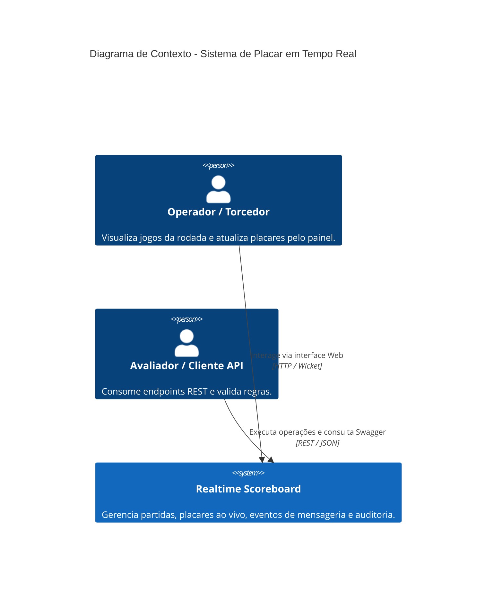
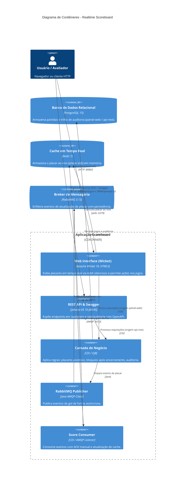

# ⚽ Realtime Scoreboard — Sistema de Placar em Tempo Real

Sistema completo para gerenciamento e atualização de placares de jogos de futebol em tempo real, desenvolvido conforme os requisitos do desafio técnico utilizando **Jakarta EE 10**, **Apache Wicket**, **Redis**, **RabbitMQ**, **PostgreSQL** e **Payara Micro**.

---

## 🏛️ 1. Arquitetura e C4 Model

O sistema foi desenhado seguindo os princípios de **Arquitetura Orientada a Eventos (EDA)** e separação rigorosa de responsabilidades.

### C4 Model — Nível 1: Contexto do Sistema



### C4 Model — Nível 2: Contêineres



---

## 🏗️ 2. Tecnologias Utilizadas

- **Linguagem & Plataforma**: Java 17 / Jakarta EE 10 (JAX-RS, CDI 4.0, EJB, JPA / EclipseLink, Bean Validation)
- **Frontend / Interface Web**: Apache Wicket 10 com atualização em tempo real isolada via AJAX (`AjaxSelfUpdatingTimerBehavior`)
- **Mensageria Assíncrona**: RabbitMQ 3.13 (AMQP) com exchange `direct` e fila durável
- **Armazenamento de Cache**: Redis 7 para consulta ultrarrápida do placar ao vivo
- **Banco de Dados Relacional**: PostgreSQL 15 com migrações automáticas via Flyway
- **Servidor de Aplicação**: Payara Micro 6.x
- **Documentação da API**: MicroProfile OpenAPI / Swagger UI nativo
- **Testes Automatizados**: JUnit 5, Mockito e AssertJ (21 testes cobrindo Regras de Negócio, API REST e Fluxo Assíncrono)

---

## 🚀 3. Como Executar o Projeto

### Pré-requisitos
- **Java JDK 17**
- **Apache Maven 3.8+** *(opcional, pois o projeto já inclui o Maven Wrapper `mvnw`)*
- **Docker Desktop** instalado, **aberto e em execução** no Windows (ícone da baleia verde / "Engine running")

### Passo 1: Gerar o pacote WAR e executar a suíte de testes (21 testes)
Na pasta raiz do projeto, execute o Maven. Como o projeto já inclui o **Maven Wrapper (`mvnw`)**, você não precisa ter o Maven instalado globalmente no sistema:

- **No Windows (Command Prompt / CMD):**
  ```cmd
  mvnw clean package
  ```
- **No PowerShell:**
  ```powershell
  .\mvnw clean package
  ```
- **Caso tenha o Maven instalado no PATH:**
  ```bash
  mvn clean package
  ```
- **Ou pelo IntelliJ IDEA:**
  Na barra lateral direita, abra a aba **Maven** -> expanda **realtime-scoreboard** -> **Lifecycle** -> dê dois cliques em **package**.

> **Nota importante:** É fundamental gerar o pacote antes de subir os contêineres pela primeira vez, para que o arquivo `target/scoreboard.war` já exista quando o Docker Compose montar o volume do Payara.

### Passo 2: Iniciar os serviços com Docker Compose
> ⚠️ **Atenção Windows:** O **Docker Desktop precisa estar aberto** no Windows antes de rodar este comando. Se o Docker Desktop estiver fechado, você receberá o erro `failed to connect to the docker API ... daemon is not running`. Abra o Docker Desktop e aguarde o ícone da baleia ficar verde.

Na pasta onde está o arquivo `docker-compose.yml`, execute:
```bash
docker compose up -d
```
Isso inicializa os 4 contêineres:
- **PostgreSQL** (`:5432`)
- **RabbitMQ** (`:5672` / `:15672`)
- **Redis** (`:6379`)
- **Payara Micro** (`:8080`)

### Passo 3: Reiniciar o Payara após alterações no código (se necessário)
Após recompilar com `mvn clean package -DskipTests`, basta reiniciar apenas o contêiner do Payara:
```bash
docker compose restart payara
```

---

## 🌐 4. Endereços de Acesso

| Serviço | URL | Descrição |
|---|---|---|
| **Interface Web (Wicket)** | [http://localhost:8080/](http://localhost:8080/) | Painel esportivo com placar ao vivo, cadastro de jogos e botões de ação |
| **Documentação Swagger UI** | [http://localhost:8080/openapi-ui](http://localhost:8080/openapi-ui) | Interface interativa OpenAPI/Swagger |
| **Especificação OpenAPI** | [http://localhost:8080/openapi](http://localhost:8080/openapi) | Documento YAML/JSON da API |
| **Trilha de Auditoria** | [http://localhost:8080/api/auditoria](http://localhost:8080/api/auditoria) | Consulta histórico de operações (`painel-web` ou `api-rest`) |
| **Health Check Completo** | [http://localhost:8080/api/health](http://localhost:8080/api/health) | Status detalhado: Postgres, Redis e RabbitMQ |
| **RabbitMQ Management** | [http://localhost:15672](http://localhost:15672) | Usuário: `sb_mq_user` / Senha: `sb_mq_password` |

---

## 📋 5. Trilha de Auditoria

O sistema possui uma tabela de auditoria desacoplada que registra todas as mutações nas partidas:

- **Origens registradas**:
  - `painel-web`: operações originadas da interface gráfica Apache Wicket.
  - `api-rest`: operações enviadas diretamente pelos clientes HTTP da API.
- **Tipos de ação auditados**:
  - `CRIACAO_PARTIDA`: registro da criação com os dados iniciais.
  - `ATUALIZACAO_PLACAR`: registro do placar anterior e novo (ex: de `1x0` para `2x0`).
  - `ALTERACAO_STATUS`: transição de estado da partida (ex: `EM_ANDAMENTO` -> `ENCERRADO`).
  - `EXCLUSAO_PARTIDA`: remoção da partida.

---

## 💻 6. Exemplos de Requisições (API REST)

### 6.1. Criar novo jogo
```bash
curl -X POST http://localhost:8080/api/jogos \
  -H "Content-Type: application/json" \
  -d '{
    "timeA": "Flamengo",
    "timeB": "Palmeiras",
    "dataHoraPartida": "2026-11-20T20:00:00"
  }'
```

### 6.2. Listar jogos (com paginação e filtros)
```bash
# Todos os jogos
curl -X GET "http://localhost:8080/api/jogos?page=0&size=10"

# Apenas jogos em andamento
curl -X GET "http://localhost:8080/api/jogos?status=EM_ANDAMENTO"

# Apenas jogos encerrados
curl -X GET "http://localhost:8080/api/jogos?status=ENCERRADO"
```

### 6.3. Atualizar placar (dispara RabbitMQ -> atualiza Redis)
```bash
curl -X PUT http://localhost:8080/api/jogos/1/placar \
  -H "Content-Type: application/json" \
  -d '{
    "placarA": 2,
    "placarB": 1
  }'
```

### 6.4. Encerrar jogo
```bash
curl -X PUT http://localhost:8080/api/jogos/1/status \
  -H "Content-Type: application/json" \
  -d '{
    "status": "ENCERRADO"
  }'
```

### 6.5. Excluir partida (via API com auditoria e limpeza de cache)
```bash
curl -X DELETE http://localhost:8080/api/jogos/1
```
*(Retorna HTTP 204 No Content e registra na tabela de auditoria com origem `api-rest`).*

### 6.6. Consultar histórico de auditoria
```bash
curl -X GET http://localhost:8080/api/auditoria
```

### 6.7. Verificar saúde dos serviços
```bash
curl -X GET http://localhost:8080/api/health
```
**Resposta:**
```json
{
  "status": "UP",
  "bancoPostgres": "UP",
  "cacheRedis": "UP",
  "mensageriaRabbitMQ": "UP"
}
```

---

## 🧪 7. Testes Automatizados (21 testes cobrindo 100% dos fluxos)

A suíte de testes cobre integralmente os requisitos funcionais, cenários BDD, camada REST e fluxo assíncrono:

### 7.1. Regras de Negócio e Serviços (`PartidaServiceTest.java` - 11 testes)
1. **Deve criar partida com placar inicial 0x0 e status EM_ANDAMENTO**
2. **Deve rejeitar criação de partida com times de mesmo nome** (HTTP 400)
3. **Deve rejeitar criação de partida com placar negativo** (HTTP 400)
4. **Cenário 1 BDD — Deve atualizar placar de jogo em andamento e publicar evento no RabbitMQ**
5. **Cenário 2 BDD — Deve impedir alteração de placar após encerramento** (HTTP 422)
6. **Deve rejeitar atualização de placar com valor negativo** (HTTP 400)
7. **Deve alterar status da partida (ex: encerrar jogo)**
8. **Deve rejeitar alteração de status com valor nulo** (HTTP 400)
9. **Deve lançar PartidaNaoEncontradaException para ID inexistente** (HTTP 404)
10. **Deve excluir partida com sucesso, gravando auditoria e limpando Redis** (HTTP 204)
11. **Deve lançar exceção ao tentar excluir partida com ID inexistente** (HTTP 404)

### 7.2. Camada REST / Endpoints da API (`JogosResourceTest.java` - 7 testes)
12. **POST /api/jogos: Deve retornar 201 Created ao cadastrar partida e registrar origem api-rest**
13. **GET /api/jogos: Deve retornar 200 OK com lista filtrada e paginada**
14. **GET /api/jogos: Deve retornar erro 400 em caso de paginação com número negativo**
15. **GET /api/jogos/{id}: Deve retornar 200 OK ao buscar por ID existente**
16. **PUT /api/jogos/{id}/placar: Deve retornar 200 OK ao atualizar placar com origem api-rest**
17. **PUT /api/jogos/{id}/status: Deve retornar 200 OK ao alterar status com origem api-rest**
18. **DELETE /api/jogos/{id}: Deve retornar 204 No Content ao excluir partida com origem api-rest**

### 7.3. Mensageria e Fluxo Assíncrono (`ScoreEventConsumerTest.java` - 3 testes)
19. **Deve processar evento ScoreEvent, atualizar Redis e enviar basicAck manual**
20. **Deve descartar mensagem com payload JSON corrompido com basicNack sem reenfileirar**
21. **Deve aplicar retry com basicNack (requeue=true) quando Redis estiver temporariamente indisponível**